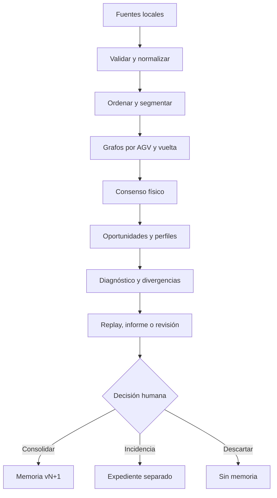

# Catálogo de algoritmos

## 1. Estrategia

El motor inicial será híbrido y explicable: reglas industriales, máquinas de estados, grafos/secuencias, estadística robusta y comparación histórica. No se necesita una IA opaca para crear valor en el piloto.

Cada ejecución registra:

- versión de aplicación;
- versiones de algoritmos y parámetros;
- versiones de configuración, calendario, reglas y grafo esperado;
- hashes de fuentes;
- advertencias de calidad;
- hash determinista del resultado semántico.

## 2. Tubería analítica

## 3. Registro de algoritmos

| ID | Acción | Proceso | Salida esperada | Complejidad objetivo | Fase |
|---|---|---|---|---|---:|
| ALG-001 | Ingesta | Parseo incremental, asignación de columnas y cuarentena | Observaciones normalizadas + informe de calidad | O(n), memoria acotada por lote | F1 |
| ALG-002 | Unión de fuentes | Alineación del tramo contiguo común entre cortes de la misma pila | Vista analítica sin doble cómputo, conservando pasos repetidos legítimos | O(n) esperado | F1 |
| ALG-003 | Afinidad de circuito | Circuito declarado cuando existe; si no, tags, transiciones, AGV y contradicciones | compatible/parcial/ajeno/desconocido | O(n+e) | F1 |
| ALG-004 | Segmentación | Cortes por AGV, tiempo, contexto y anclas | Sesiones y vueltas con confianza | O(n log n) por ordenación; O(n) posterior | F2 |
| ALG-005 | Grafo observado | Conteo de transiciones por AGV/vuelta | Multigrafo trazable | O(n) | F2 |
| ALG-006 | Consenso topológico | Soporte entre AGV/vueltas y estadística robusta | Grafo físico inferido con alternativas | O(e·a) acotado | F2 |
| ALG-007 | Oportunidades | Contexto predecesor/sucesor, ruta y huecos | Oportunidades elegibles, censuradas o desconocidas | O(n)–O(n log n) | F3 |
| ALG-008 | Salud contextual | Lecturas/oportunidades, estabilidad y calidad | Salud + desglose + intervalo/confianza | O(t·a·c) sobre agregados | F3 |
| ALG-009 | Divergencia colectiva | Comparación individual, cohorte, flota e histórico | Individual/grupal/colectiva + explicación | O(m) sobre métricas | F3 |
| ALG-010 | Perfil temporal | Mediana, cuantiles, MAD y calendario | Esperado por tramo/contexto | O(n log n), optimizable | F3 |
| ALG-011 | FIFO/flujo | Máquina de estados por zona y orden relativo | Roturas sustentadas, censuras y saturación | O(n) | F3 |
| ALG-012 | Carga online | Máquina de estados por cada calle configurada | Entradas, ocupación, permanencia, salidas y anomalías | O(n) | F3 |
| ALG-013 | Puntos críticos | Llegadas frente a takt/calendario y causas aguas arriba | Ventanas de riesgo e impacto | O(n) | F3 |
| ALG-014 | Consolidación | Reducción versionada y cálculo de delta | Nueva memoria compacta append-only | O(m), no O(histórico bruto) | F4 |
| ALG-015 | Retroceso causal | Búsqueda temporal/topológica hacia atrás | Cadena de hechos e hipótesis alternativas | Limitada a ventana/subgrafo | F5 |
| ALG-016 | Replay multi-AGV | Estado observado/inferido por instante | Movimiento sobre grafo con incertidumbre | Precálculo + consulta incremental | F5 |
| ALG-017 | Similitud de casos | Características explicables de incidencias | Casos comparables y diferencias | O(k·d) | F5 |
| ALG-018 | Expediente por objeto | Agregación por AGV o por tag y contraste con su cohorte | Recuentos, tags leídos y no leídos, contraparte que sí leyó, y evidencia navegable | O(n) sobre agregados | F2 reducido, F3 completo |
| ALG-019 | Inactividad e instante de cambio | Detección de silencios por objeto y del punto donde el comportamiento cambia | Periodos de inactividad clasificados e instante de cambio con alternativas | O(n) por objeto | F2 reducido, F3 completo |

## 4. Oportunidades y salud

Una oportunidad para el tag `t` existe solo si el recorrido aporta contexto suficiente: predecesor, sucesor, ruta alternativa, ventana temporal y estado del circuito. El resultado puede ser:

- `eligible-read`: oportunidad válida de lectura;
- `suppressed-repeat-possible`: el lector pudo omitir una repetición;
- `censored-gap`: faltan comunicaciones/evidencia;
- `route-not-taken`: el AGV no pasó por ese ramal;
- `unknown`: no se puede decidir.

La tasa básica, usada solo sobre oportunidades elegibles, es:

\[
R_{tag,agv,contexto}=\frac{lecturas\ observadas}{oportunidades\ elegibles}
\]

La salud publicada no será solo `R`. Incorporará estabilidad temporal, acuerdo con pares, calidad de datos y criticidad, mostrando cada componente por separado. Los pesos no se fijan hasta calibración con casos de oro.

El multicircuito vigente forma parte del contexto de la oportunidad, porque puede alterar las
condiciones físicas de detección: bajo un multicircuito de alcance reducido una ausencia es
esperable y no debe contar como degradación. Cuando la fuente no aporta el multicircuito, la salud
del periodo se publica con el confusor declarado, no como si el contexto fuera homogéneo.

## 4.1 Resolución de la fuente y análisis temporal

Cada fuente declara su resolución temporal y el análisis se ajusta a ella. Una transición cuyo
intervalo observado cae por debajo de la resolución **no tiene tiempo medible**: es `observed` en
secuencia y `unknown` en tiempo. Agregar esos ceros produciría medianas y dispersiones falsas.

En la práctica esto separa dos familias:

- **Fenómenos lentos** —permanencia en calles CO, intervalos en puntos críticos, huecos— donde el
  tiempo es varias veces la resolución y la estadística robusta es válida.
- **Transiciones rápidas**, donde solo el orden es utilizable mientras la fuente no aporte más
  resolución.

Una fuente de mayor resolución no invalida los análisis anteriores: cambia lo que es lícito medir a
partir de ella, y eso queda registrado con el resultado.

## 4.2 Inactividad e instante de cambio

Un AGV detenido **no emite lecturas** (R-AGV-006). La consecuencia es incómoda y hay que asumirla:
la inactividad real, el fallo de comunicación y la salida del circuito producen exactamente el mismo
dato, que es la ausencia de dato. No se distinguen mirando el silencio, sino su contexto.

ALG-019 clasifica cada silencio de un objeto usando cinco discriminantes, en este orden:

1. **Cobertura.** Si el intervalo cae fuera de lo cargado, es `sin datos cargados` y el análisis
   termina ahí (R-DAT-007). Ninguna de las hipótesis siguientes llega a plantearse.
2. **Contexto colectivo.** Si el resto de la flota sigue emitiendo con normalidad, el silencio es
   propio del objeto. Si callan muchos a la vez, apunta a infraestructura, proceso o parada
   (R-COM-003, R-FLO-005).
3. **Punto de la última lectura.** Dónde calló discrimina más que cuánto calló: el final de una
   calle de carga, una zona de mantenimiento o un punto intermedio del recorrido productivo
   sugieren hipótesis distintas.
4. **Calendario.** Un silencio que coincide con una parada prevista no es una anomalía.
5. **Forma de la reaparición.** Los cuatro anteriores miran hacia atrás y hacia los lados. Este
   mira hacia delante, y es el único que puede elevar un silencio de `unknown` a una inferencia
   con soporte. Ver §4.3.

La salida es un periodo de inactividad con hipótesis ordenadas y su evidencia, nunca una causa
única. El **instante de cambio** se sitúa en la última lectura antes del silencio, y se marca como
`inferred`: es el último momento del que hay evidencia, no el instante en que el objeto dejó de
funcionar, que puede ser posterior y desconocido.

Para un tag, el mismo algoritmo responde otra pregunta: desde cuándo dejó de leerlo **cada** AGV.
Que un solo AGV deje de leerlo mientras los demás siguen apunta a ese AGV o su lector; que dejen
todos a la vez apunta al tag, a su ubicación o a un cambio físico (R-GRA-005).

## 4.3 Firmas de reaparición

Cómo vuelve un objeto informa tanto como cómo se fue. Dos firmas están identificadas.

### Firma de carga online

La última lectura antes del silencio es el tag de parada de una calle CO **configurada**, y la
reanudación recorre en orden la secuencia de tags declarada para esa calle y las posteriores.

No es una corazonada: la secuencia está en la configuración (DS-004), así que la firma se comprueba
contra un valor declarado, no contra una expectativa del algoritmo. Salida: `en carga online`,
estado `inferred`, con la calle identificada y el grado de coincidencia de la secuencia.

Degradación explícita: sin calles CO configuradas la firma **no puede reconocerse**, y el silencio
permanece `unknown` declarando esa razón. No se sustituye por una heurística de proximidad.

### Firma de hueco conservado

El objeto desaparece y reaparece manteniendo su posición relativa entre los mismos vecinos, sin
intercambio de AGV. Es R-OPP-004 aplicado al expediente de un objeto.

Demuestra una cosa concreta: **permaneció en el circuito**. Descarta salida y retirada. No demuestra
por sí sola si estuvo detenido o si siguió circulando sin ser leído; eso lo discrimina dónde
reaparece frente a cuánto avanzaron sus vecinos en la misma ventana:

| Reaparece | Vecinos | Hipótesis prioritaria |
|---|---|---|
| Más adelante, coherente con el avance del grupo | Avanzaron lo esperado | Circuló sin ser leído: lector o comunicación |
| Cerca de donde desapareció | Avanzaron y volvieron a alcanzarle | Estuvo detenido |
| Siguiendo la secuencia de una calle CO | — | Firma de carga online |

Ambas firmas producen inferencias, nunca observaciones: no se crea ninguna lectura para rellenar el
silencio (R-EVI-002).

### El umbral no es un número

La duración que hace significativo un silencio es configuración con vigencia y se expresa **relativa
al ciclo local del tramo**, no en minutos absolutos (R-OPP-006, R-FLO-004). El mismo silencio puede
ser normal en un tramo y anómalo en otro, y ninguna cifra de referencia se fija en el código.

## 5. Estadística robusta

- Mediana y cuantiles para tiempos de tramo/permanencia.
- MAD o IQR para dispersión, evitando que una parada sesgue el esperado.
- Soporte mínimo por contexto antes de crear un perfil.
- Intervalos y tamaño de muestra visibles.
- Separación por calendario, zona, configuración y cohortes cuando exista evidencia de comportamiento distinto.

No se usará una media global que mezcle operación, pausa, parada, incidencia o versiones incompatibles.

## 6. Consenso y divergencia

El consenso conserva tanto la ruta dominante como alternativas con soporte. Una diferencia se clasifica inicialmente como:

| Patrón | Hipótesis prioritaria | No permite afirmar por sí solo |
|---|---|---|
| Un AGV diverge | AGV, lector o memoria/configuración | Tag físico defectuoso |
| Pocos AGV coherentes entre sí | Cohorte/configuración no actualizada | Cambio del circuito completo |
| Mayoría de AGV en un tag/tramo | Tag, ubicación, infraestructura o cambio físico | Causa exacta |
| Muchos AGV simultáneamente | Comunicación, proceso, saturación o calendario | Fallos independientes |
| Todos cambian de secuencia sostenidamente | Evolución física/configurada | Que Vsystem sea necesariamente incorrecto |

Cada diagnóstico conserva explicaciones alternativas y acciones de comprobación.

## 7. Segmentación de vueltas y huecos

Las vueltas se detectarán con anclas configurables, repetición de secuencias, dirección y límites temporales. Si el corte es incierto se conserva `partial-lap` o `unknown`; no se fuerza una vuelta completa.

Para un hueco:

1. comprobar comunicaciones y densidad colectiva;
2. comparar AGV anterior/posterior y orden relativo;
3. evaluar continuidad topológica y tiempo plausible;
4. buscar eventos de mantenimiento/asistencia o cambio de ruta;
5. asignar estado y confianza.

## 8. FIFO y carga online

FIFO se evalúa como orden relativo dentro de límites versionados de zona cargada. La zona vacía, CO y movimientos manuales son contextos distintos. Cada calle CO configurada usa estados:

`unknown → approaching → entering → occupied → leaving → clear`, con transiciones incompletas permitidas y señaladas.

No se calcula salud de carga con SOC. Se analizan secuencias, ocupación, permanencia, rotación, ausencia de entrada/salida y relación con comunicación.

## 9. Punto crítico y análisis temporal

Las llegadas se comparan con el takt y calendario vigentes. Un intervalo sin llegada —por ejemplo diez minutos— activa la búsqueda hacia atrás sobre:

- alimentación del tramo;
- orden FIFO y acumulación;
- estados de CO;
- silencios colectivos;
- AGV divergentes;
- cambios respecto al esperado de ese horario.

El informe distingue correlación, secuencia causal plausible y causa confirmada.

## 10. Mejoras posteriores

Solo tras disponer de etiquetas humanas y métricas de precisión se considerarán:

- detección no supervisada de patrones nuevos;
- modelos supervisados para priorizar hipótesis;
- predicción temprana de saturación;
- aprendizaje de embeddings de incidencias.

Todo modelo será candidato en sombra, comparado con el algoritmo estable, explicable en sus entradas y sin alterar históricos consolidados.
