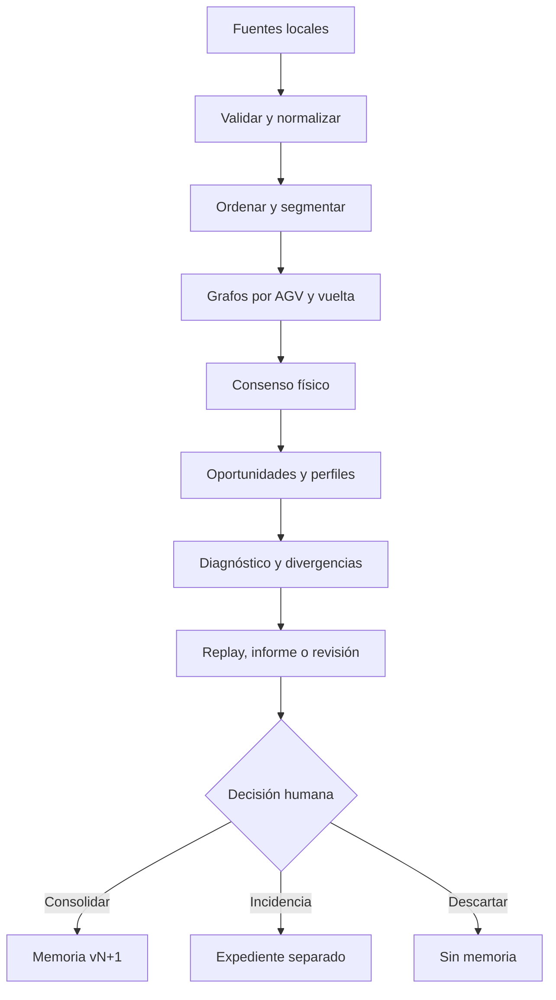

# Catálogo de algoritmos

## 1. Estrategia

El motor inicial será híbrido y explicable: reglas industriales, máquinas de estados, grafos/secuencias, estadística robusta y comparación histórica. No se necesita una IA opaca para crear valor en el piloto.

Cada ejecución registra:

- versión de aplicación;
- versiones de algoritmos y parámetros;
- versiones de configuración, calendario, reglas y grafo esperado;
- hashes de fuentes;
- advertencias de calidad;
- hash determinista del resultado semántico.

## 2. Tubería analítica

## 3. Registro de algoritmos

| ID | Acción | Proceso | Salida esperada | Complejidad objetivo | Fase |
|---|---|---|---|---|---:|
| ALG-001 | Ingesta | Parseo incremental, asignación de columnas y cuarentena | Observaciones normalizadas + informe de calidad | O(n), memoria acotada por lote | F1 |
| ALG-002 | Unión de fuentes | Alineación del tramo contiguo común entre cortes de la misma pila | Vista analítica sin doble cómputo, conservando pasos repetidos legítimos | O(n) esperado | F1 |
| ALG-003 | Afinidad de circuito | Circuito declarado cuando existe; si no, tags, transiciones, AGV y contradicciones | compatible/parcial/ajeno/desconocido | O(n+e) | F1 |
| ALG-004 | Segmentación | Ciclo dominante del cohorte, ancla declarada resuelta por rotación (§7.1) | Vueltas `completa`/`parcial`/`desconocida`, con `truth` dependiente de la ancla y de la completitud | O(n log n) por ordenación; O(n) posterior | F2 |
| ALG-005 | Grafo observado | Conteo de transiciones por AGV/vuelta | Multigrafo trazable | O(n) | F2 |
| ALG-006 | Consenso topológico | Soporte entre AGV/vueltas y estadística robusta | Grafo físico inferido con alternativas | O(e·a) acotado | F2 |
| ALG-007 | Oportunidades | Contexto predecesor/sucesor, ruta y huecos | Oportunidades elegibles, censuradas o desconocidas | O(n)–O(n log n) | F3 |
| ALG-008 | Salud contextual | Lecturas/oportunidades, estabilidad y calidad | Salud + desglose + intervalo/confianza | O(t·a·c) sobre agregados | F3 |
| ALG-009 | Divergencia colectiva | Comparación individual, cohorte, flota e histórico (histórico, §6.1–6.2) | Individual/grupal/colectiva + explicación | O(m) sobre métricas | F3 |
| ALG-010 | Perfil temporal | Mediana, cuantiles, MAD y calendario | Esperado por tramo/contexto | O(n log n), optimizable | F3 |
| ALG-011 | FIFO/flujo | Tramos de zona cargada derivados del anillo, inversión de orden con margen dual (§8.1) | Adelantamientos candidatos, nunca averías confirmadas | O(n) | F3 |
| ALG-012 | Carga online | Máquina de estados por cada calle configurada | Entradas, ocupación, permanencia, salidas y anomalías | O(n) | F3 |
| ALG-013 | Puntos críticos | Llegadas frente a takt/calendario y causas aguas arriba | Ventanas de riesgo e impacto | O(n) | F3 |
| ALG-014 | Consolidación | Reducción versionada y cálculo de delta | Nueva memoria compacta append-only | O(m), no O(histórico bruto) | F4 |
| ALG-015 | Retroceso causal | Búsqueda temporal/topológica hacia atrás | Cadena de hechos e hipótesis alternativas | Limitada a ventana/subgrafo | F5 |
| ALG-016 | Replay multi-AGV | Estado observado/inferido por instante | Movimiento sobre grafo con incertidumbre | Precálculo + consulta incremental | F5 |
| ALG-017 | Similitud de casos | Características explicables de incidencias | Casos comparables y diferencias | O(k·d) | F5 |
| ALG-018 | Expediente por objeto | Agregación por AGV o por tag y contraste con su cohorte | Recuentos, tags leídos y no leídos, contraparte que sí leyó, y evidencia navegable | O(n) sobre agregados | F2 reducido, F3 completo |
| ALG-019 | Inactividad e instante de cambio | Detección de silencios por objeto y del punto donde el comportamiento cambia | Periodos de inactividad clasificados e instante de cambio con alternativas | O(n) por objeto | F2 reducido, F3 completo |
| ALG-020 | Rotura y degradación de tasa de lectura | Segmentación binaria de un corte, después caída monótona por tramos | Instante de rotura o tendencia sostenida, por tag y por AGV | O(n) sobre la línea de pasadas | F3 |
| ALG-021 | Candidatos a punto crítico | Reparto de sucesores sostenido (bifurcación/cruce), coeficiente de variación (parada precisa), mayor salto proporcional (semáforo) | Candidatos por clase con evidencia y soporte, nunca asignación | O(n) | F3 |
| ALG-022 | Cambios de tag dentro de un periodo | Pasadas por el sitio del tag; racha fuera de su vida larga e improbable por azar; pareja unívoca por vecino compartido | Cambios, tags que dejan o empiezan a leerse, su vida, y la diferencia de cada AGV frente al nuevo | O(n) sobre las lecturas | F3 |
| ALG-023 | Lectura por AGV | Celdas dentro de la vida del tag; nunca, desde una hora, poco con cola binomial frente al resto | Por AGV y por tag, la diferencia medida y si pasa en muchos o en pocos tags | O(celdas) | F3 |

## 4. Oportunidades y salud

Una oportunidad para el tag `t` existe solo si el recorrido aporta contexto suficiente: predecesor, sucesor, ruta alternativa, ventana temporal y estado del circuito. El resultado puede ser:

- `eligible-read`: oportunidad válida de lectura;
- `suppressed-repeat-possible`: el lector pudo omitir una repetición;
- `censored-gap`: faltan comunicaciones/evidencia;
- `route-not-taken`: el AGV no pasó por ese ramal;
- `unknown`: no se puede decidir.

La tasa básica, usada solo sobre oportunidades elegibles, es:

\[
R_{tag,agv,contexto}=\frac{lecturas\ observadas}{oportunidades\ elegibles}
\]

La salud publicada no será solo `R`. Incorporará estabilidad temporal, acuerdo con pares, calidad de datos y criticidad, mostrando cada componente por separado. Los pesos no se fijan hasta calibración con casos de oro.

El multicircuito vigente forma parte del contexto de la oportunidad, porque puede alterar las
condiciones físicas de detección: bajo un multicircuito de alcance reducido una ausencia es
esperable y no debe contar como degradación. Cuando la fuente no aporta el multicircuito, la salud
del periodo se publica con el confusor declarado, no como si el contexto fuera homogéneo.

## 4.1 Resolución de la fuente y análisis temporal

Cada fuente declara su resolución temporal y el análisis se ajusta a ella. Una transición cuyo
intervalo observado cae por debajo de la resolución **no tiene tiempo medible**: es `observed` en
secuencia y `unknown` en tiempo. Agregar esos ceros produciría medianas y dispersiones falsas.

En la práctica esto separa dos familias:

- **Fenómenos lentos** —permanencia en calles CO, intervalos en puntos críticos, huecos— donde el
  tiempo es varias veces la resolución y la estadística robusta es válida.
- **Transiciones rápidas**, donde solo el orden es utilizable mientras la fuente no aporte más
  resolución.

Una fuente de mayor resolución no invalida los análisis anteriores: cambia lo que es lícito medir a
partir de ella, y eso queda registrado con el resultado.

## 4.2 Inactividad e instante de cambio

Un AGV detenido **no emite lecturas** (R-AGV-006). La consecuencia es incómoda y hay que asumirla:
la inactividad real, el fallo de comunicación y la salida del circuito producen exactamente el mismo
dato, que es la ausencia de dato. No se distinguen mirando el silencio, sino su contexto.

ALG-019 clasifica cada silencio de un objeto usando cinco discriminantes, en este orden:

1. **Cobertura.** Si el intervalo cae fuera de lo cargado, es `sin datos cargados` y el análisis
   termina ahí (R-DAT-007). Ninguna de las hipótesis siguientes llega a plantearse.
2. **Contexto colectivo.** Si el resto de la flota sigue emitiendo con normalidad, el silencio es
   propio del objeto. Si callan muchos a la vez, apunta a infraestructura, proceso o parada
   (R-COM-003, R-FLO-005).
3. **Punto de la última lectura.** Dónde calló discrimina más que cuánto calló: el final de una
   calle de carga, una zona de mantenimiento o un punto intermedio del recorrido productivo
   sugieren hipótesis distintas.
4. **Calendario.** Un silencio que coincide con una parada prevista no es una anomalía.
5. **Forma de la reaparición.** Los cuatro anteriores miran hacia atrás y hacia los lados. Este
   mira hacia delante, y es el único que puede elevar un silencio de `unknown` a una inferencia
   con soporte. Ver §4.3.

La salida es un periodo de inactividad con hipótesis ordenadas y su evidencia, nunca una causa
única. El **instante de cambio** se sitúa en la última lectura antes del silencio, y se marca como
`inferred`: es el último momento del que hay evidencia, no el instante en que el objeto dejó de
funcionar, que puede ser posterior y desconocido.

Para un tag, el mismo algoritmo responde otra pregunta: desde cuándo dejó de leerlo **cada** AGV.
Que un solo AGV deje de leerlo mientras los demás siguen apunta a ese AGV o su lector; que dejen
todos a la vez apunta al tag, a su ubicación o a un cambio físico (R-GRA-005).

## 4.3 Firmas de reaparición

Cómo vuelve un objeto informa tanto como cómo se fue. Dos firmas están identificadas.

### Firma de carga online

La última lectura antes del silencio es el tag de parada de una calle CO **configurada**, y la
reanudación recorre en orden la secuencia de tags declarada para esa calle y las posteriores.

No es una corazonada: la secuencia está en la configuración (DS-004), así que la firma se comprueba
contra un valor declarado, no contra una expectativa del algoritmo. Salida: `en carga online`,
estado `inferred`, con la calle identificada y el grado de coincidencia de la secuencia.

Degradación explícita: sin calles CO configuradas la firma **no puede reconocerse**, y el silencio
permanece `unknown` declarando esa razón. No se sustituye por una heurística de proximidad.

### Firma de hueco conservado

El objeto desaparece y reaparece manteniendo su posición relativa entre los mismos vecinos, sin
intercambio de AGV. Es R-OPP-004 aplicado al expediente de un objeto.

La reaparición se busca **hacia delante en el tiempo**: no es volver a verlo en el mismo instante,
sino más tarde, y lo que discrimina es qué hicieron sus vecinos durante ese intervalo.

Demuestra una cosa concreta: **permaneció en el circuito**. Descarta salida y retirada. Lo demás lo
deciden dos contrastes: si los vecinos avanzaron, y cuánto se aparta el tiempo del esperado para ese
tramo.

| El objeto | Sus vecinos en la misma ventana | Tiempo frente al esperado del tramo | Lectura prioritaria |
|---|---|---|---|
| Reaparece conservando posición | **Tampoco avanzaron** | — | Fallo **colectivo**: la línea está detenida. No es de este objeto, y buscarle causa propia sería un error |
| Reaparece conservando posición | Avanzaron con normalidad | Muy por encima del esperado | Fallo **individual**: estuvo detenido de forma anómala |
| Reaparece más adelante, coherente con el grupo | Avanzaron lo esperado | Dentro de lo normal | Circuló **sin ser leído**: lector o comunicación |
| Reaparece siguiendo la secuencia de una calle CO | — | — | Firma de carga online, que se comprueba antes que las demás |

Que los vecinos tampoco avanzaran es la señal que separa un vehículo averiado de una línea parada,
y tiene prioridad sobre las demás: es R-FLO-005 leído desde el expediente de un objeto. Si el que va
delante tampoco se movió, la causa está aguas arriba y atribuirla a este objeto sería un falso
diagnóstico individual.

**Dónde vale esta firma.** El vecindario se deriva del orden relativo, que solo es estable donde
está garantizado. En zona cargada se espera FIFO (R-FLO-001) y la firma es fuerte. En zona vacía se
admite reordenación (R-FLO-002), así que el vecindario es débil y la firma baja de confianza en
lugar de aplicarse igual. Una calle CO queda fuera del FIFO cargado (R-FLO-003), y por eso su firma
se comprueba primero: entrar a cargar es una salida legítima del orden, no una anomalía.

**El exceso de tiempo sí es medible.** Aunque a resolución gruesa la mayoría de las transiciones no
tiene tiempo observable (§4.1), estas detenciones duran varias veces la resolución. La firma vive
precisamente en la banda que sí se puede medir. El esperado del tramo es robusto —mediana y
dispersión de ALG-010— y el factor que hace «bastante» un exceso es configuración con vigencia.

Ambas firmas producen inferencias, nunca observaciones: no se crea ninguna lectura para rellenar el
silencio (R-EVI-002).

### El umbral no es un número

La duración que hace significativo un silencio es configuración con vigencia y se expresa **relativa
al ciclo local del tramo**, no en minutos absolutos (R-OPP-006, R-FLO-004). El mismo silencio puede
ser normal en un tramo y anómalo en otro, y ninguna cifra de referencia se fija en el código.

### Sexto discriminante: reaparecer donde el circuito no llega

Los cinco anteriores miran hacia atrás, hacia los lados y hacia delante **dentro** del circuito.
Ninguno contempla que el objeto se haya ido a otro.

Si el par (último tag antes del silencio → primer tag después) es una transición que sus vecinos de
circuito también hacen, el objeto estuvo **ahí parado**. Hasta ahí es barato. Lo que **no** vale es
el recíproco, y darlo por bueno fue un error de este catálogo: que ningún vecino haga ese salto no
demuestra que el objeto se fuera, demuestra que **dejó de leer**. Un vehículo que recorre su propia
línea sin registrar catorce tags reaparece dando un salto que nadie más da, sin haberse movido.

La comprobación completa tiene dos partes, y la segunda es la que decide (R-AGV-012):

1. ¿Se alcanza el tag de reanudación siguiendo la línea desde donde desapareció? Si no, no se llega
   desde ahí y la salida se sostiene.
2. Si se alcanza, ¿cuánto tardó frente a lo que tarda el cohorte **por ese mismo tramo, medido de
   extremo a extremo**? Dentro de su rango, el objeto estuvo ahí y lo que hay es un tramo recorrido
   sin leer. Solo por encima se sostiene que estuvo en otro sitio.

La comparación va contra el recorrido medido, nunca contra la suma de tiempos de cada arista: donde
la carga se hace en ruta, un tramo con parada de trabajo tiene una dispersión tal que cualquier
umbral sobre la suma dispara solo. Releer el mismo tag tampoco es ir a ninguna parte.

Medido sobre una exportación real de tres circuitos, la diferencia entre aplicar solo el primer
criterio y aplicar los dos es la diferencia entre un diagnóstico y un falso positivo: el vehículo
que parecía irse cinco veces no se va **ninguna**. Lo que tiene son cuatro tramos recorridos sin
leer, cuarenta tags en total, frente a cero o catorce de sus trece compañeros. Sigue siendo el
vehículo anómalo de la exportación, pero por lectura y no por trayecto, y el hallazgo que se le
atribuya cambia entero.

Un corolario que hay que aplicar antes que nada de lo anterior: **dos lecturas en el mismo instante
no ordenan nada** (R-DAT-013). Su orden es posición de pila, no medida del reloj, así que aparecen
en las dos direcciones y la minoritaria simula un desvío que nunca ocurrió. Antes de discriminar
nada, esas aristas se retiran del razonamiento topológico.

**Y salir del circuito no es una reubicación benigna: es una anomalía por diseño.** Los cruces
llevan un par de tags de protección precisamente para detener a un vehículo que se desvía, así que
un objeto que se fue significa que algo no funcionó. Las hipótesis son enumerables:

| Evidencia en las lecturas | Hipótesis |
|---|---|
| los tags de protección aparecen y salió igual | la lectura funcionó; la orden no se ejecutó |
| los tags de protección no aparecen | falló la lectura de la protección |
| salió antes del segundo tag del par | se desvió entre uno y otro |

Ambas ramas son `inferred` y se presentan con su evidencia, nunca como causa única. Lo que sigue sin
ser medible es la **ausencia de lecturas mientras está fuera**; el hallazgo es la salida, no el
silencio — son dos cosas distintas y conviene no mezclarlas.

Cruzar exportaciones **no** confirma dónde estuvo: si el vehículo no lleva en memoria los tags del
circuito de destino, no aparece en su exportación (R-OPP-009).

## 4.4 Rotura súbita y degradación progresiva (R-OPP-015)

La matriz de lectura de R-OPP-013 resume cada par (tag, AGV) en una tasa sobre toda la ventana, y
esa tasa es ciega al **cuándo**: un tag que se lee al 100 % y desaparece de golpe a mitad de la
ventana sale con el mismo aspecto que uno que siempre estuvo a la mitad. ALG-020 mira la misma
evidencia —pasadas probadas, con acierto o sin él (R-OPP-014)— pero ordenada en el tiempo.

**Es una segunda mirada sobre lo ya calculado, no una relectura de la fuente.** La primera pasada es
el mismo recorrido que ya construye la matriz; lo único que cambia es que, además de sumar a un
contador, se retiene el instante de cada pasada probada en una línea temporal por tag y por AGV. La
segunda pasada es un post-proceso barato sobre esas líneas, del orden de las lecturas totales.

Dos vías, en este orden y sin mezclarlas —el mismo principio que R-OPP-014 aplica a vecinos/tiempo/
orden—:

1. **Rotura súbita.** Segmentación binaria de un único corte: se prueba cada punto de la línea y se
   queda el que maximiza la diferencia de tasa entre lo de antes y lo de después. El instante que se
   publica es el punto medio entre la última pasada de antes y la primera de después —no se puede
   precisar más—, y solo cuenta si la caída supera un umbral generoso (el caso de manual es
   100 % → 0 %).
2. **Degradación progresiva**, solo si no hubo rotura. La línea se divide en tramos **por recuento**,
   no por tiempo —la densidad de pasadas no es uniforme—, y cuenta si la tasa de cada tramo no crece
   nunca respecto al anterior y la caída entre el primero y el último supera un umbral propio.

**El corte tiene que representar una fracción real de la línea, no solo un recuento.** Con líneas
largas, una racha corta de mala suerte al final —cinco pasadas sin acierto entre quinientas— puede
parecer un corte más brusco que una tendencia real repartida por toda la ventana. El mínimo a cada
lado del corte se exige tanto en número absoluto como en proporción de la línea.

**Un AGV se examina igual, sobre su propia línea.** Todas sus pasadas probadas, en cualquier tag,
ordenadas en el tiempo: un lector que falla cada vez más lo hace en varios tags a la vez, y su
propia línea lo muestra sin que haga falta mirar tag por tag. Lo que no puede pasar es que ese
hallazgo se traslade a los tags que lee: si el resto de la flota los sigue leyendo con normalidad,
esos tags no llevan ni corte ni tendencia — es un riesgo real, no teórico: un tag `bimodal-candidato`
mezcla en una sola línea temporal los aciertos de quien siempre lo lee y los fallos de quien nunca lo
lee, y si esas dos poblaciones estuvieran agrupadas por bloques de tiempo en vez de entrelazadas, un
corte binario las confundiría con una rotura.

## 5. Estadística robusta

- Mediana y cuantiles para tiempos de tramo/permanencia.
- MAD o IQR para dispersión, evitando que una parada sesgue el esperado.
- Soporte mínimo por contexto antes de crear un perfil.
- Intervalos y tamaño de muestra visibles.
- Separación por calendario, zona, configuración y cohortes cuando exista evidencia de comportamiento distinto.

No se usará una media global que mezcle operación, pausa, parada, incidencia o versiones incompatibles.

## 6. Consenso y divergencia

El consenso conserva tanto la ruta dominante como alternativas con soporte. Una diferencia se clasifica inicialmente como:

| Patrón | Hipótesis prioritaria | No permite afirmar por sí solo |
|---|---|---|
| Un AGV diverge | AGV, lector o memoria/configuración | Tag físico defectuoso |
| Pocos AGV coherentes entre sí | Cohorte/configuración no actualizada | Cambio del circuito completo |
| Mayoría de AGV en un tag/tramo | Tag, ubicación, infraestructura o cambio físico | Causa exacta |
| Muchos AGV simultáneamente | Comunicación, proceso, saturación o calendario | Fallos independientes |
| Todos cambian de secuencia sostenidamente | Evolución física/configurada | Que Vsystem sea necesariamente incorrecto |

Cada diagnóstico conserva explicaciones alternativas y acciones de comprobación.

## 6.1 Comparación entre dos periodos distantes, implementado (R-DAT-016, R-AGV-013)

Es la pieza «histórico» de ALG-009: con una sola ventana, un tag sin lecturas es indistinguible entre
obsoleto y averiado, y un vehículo que no lee un tag es indistinguible entre «nunca lo llevó en
memoria» y «lo perdió». Lo que separa las dos explicaciones es el tiempo (R-DAT-016).

**No hace falta pedir un segundo fichero.** `coverage` ya es la unión de los intervalos de todas las
fuentes aceptadas (`mergeIntervals`); dos exportaciones separadas en el tiempo producen, sin nada
más, dos o más intervalos disjuntos. `compareDistantPeriods` (`src/domain/drift.ts`) usa el primero y
el último —nunca periodos intermedios— y exige un hueco mínimo entre ambos (`minGapMs`) para no
tratar como «distantes» dos fuentes casi contiguas.

Cuatro comparaciones, todas binarias —presencia o ausencia, sin ningún umbral de magnitud— salvo la
guarda de soporte:

| Comparación | Resultado |
|---|---|
| Leído en el periodo temprano, nada en el tardío | `desaparecido`: cambió — murió, se sustituyó o se retiró; el dato no dice cuál |
| Nada en el temprano, leído en el tardío | `nuevo`: sustitución o instalación |
| Nada en los dos periodos, y el tag está declarado en alguna lista | `obsoleto-consolidado`: más soporte que una sola ventana, nunca `confirmed` sin ir a mirarlo |
| Un vehículo leía un tag y deja de leerlo, mientras el resto de la flota lo sigue leyendo | Deriva de ese vehículo (R-AGV-013): memoria actualizada o lector degradado, nunca avería del tag |

**Guarda de soporte, encontrada auditando el propio detector.** Un tag con tasa de lectura
probabilística (una tasa media o una degradación ya conocidas por otro motivo) puede, por puro azar,
no producir ninguna lectura de un vehículo concreto en el periodo tardío aunque ese vehículo lo
hubiera leído antes: no es una deriva, es la misma variabilidad que ya explica esa tasa. La deriva de
vehículo solo cuenta un tag si ese vehículo lo leyó, en el periodo temprano, al menos
`minReadingsPerVehicle` veces — el mismo umbral y la misma razón que ya usa `BlindnessThresholds`: por
debajo, un puñado de lecturas no sostiene ningún patrón que la ausencia después pueda contradecir.

**Lo que esto no hace.** No implementa el tercer descarte que R-DAT-016 también anuncia —comprobar
con tiempos si el tramo que rodea a un tag obsoleto se recorre en directo—, que es geométrico y no
temporal. No compara periodos intermedios cuando hay más de dos. No reclasifica el inventario de una
sola ventana (`inventory.ts`): es una vista complementaria que se cruza por `tagId`.

## 6.2 Sustitución candidata y adopción de tag nuevo, implementado (R-DAT-017, R-AGV-013 ampliada)

Refina las dos comparaciones binarias `desaparecido`/`nuevo` de §6.1 en dos direcciones, sin apoyarse
en el anillo ni en el ciclo dominante en ningún momento (`drift.ts` no depende de `laps.ts`/
`cohort.ts` a propósito, decisión de la Parte 33 que se mantiene aquí).

**Firma de vecino por secuencia cronológica.** Para cada tag y cada periodo, se recorre la secuencia
de lecturas de cada vehículo ordenada por tiempo y se cuenta, para cada tag, qué tag lo precede y qué
tag lo sucede con más frecuencia (`buildNeighborTally`). El vecino con más cuenta es el dominante; un
empate exacto en el máximo no produce dominante (`dominant`) — sin firma no hay pareja posible, en vez
de adivinar cuál de los empatados es el vecino real.

**Emparejamiento bipartito unívoco.** Un tag `desaparecido` D y un tag `nuevo` N se correlacionan
como sustitución candidata solo si comparten vecino dominante en el mismo lado —mismo predecesor o
mismo sucesor, sucesor probado primero, desempate determinista si coinciden los dos— **y** la
correlación es unívoca en los dos sentidos: D coincide con exactamente un N compatible, y ese N
coincide con exactamente ese D. Con 0 o 2+ coincidencias en cualquiera de los dos lados, no se
empareja: los dos quedan como hallazgos sueltos (R-EVI-004). El vecino compartido nunca puede ser él
mismo un tag que desaparece o aparece, y esto no exige ninguna comprobación aparte: para que el mismo
vecino aparezca en la firma temprana de D y en la firma tardía de N tiene que tener lecturas en los
dos periodos, lo que ya lo excluye de ser `desaparecido` o `nuevo` por construcción — una garantía del
propio dato, no una validación añadida por si acaso. Solo se intenta emparejar con soporte de sobra a
cada lado (`minReadingsPerVehicle`, el mismo umbral de §6.1).

**Adopción de tag nuevo, sin topología.** Un tag `nuevo` —o el lado nuevo de una sustitución
candidata— ya leído por al menos `minAdoptionShare` de los testigos tardíos (mismo valor que
`ReadRateThresholds.highRate`, misma idea de «lo lee casi todo el mundo» aplicada a cuántos vehículos
en vez de a cuántas veces) señala, en cada testigo tardío que no lo ha leído ni una vez, un candidato
a memoria no actualizada. No hace falta saber si el vehículo pasa físicamente por ese punto: un tag de
una rama que solo recorre parte de la flota nunca alcanza la cuota de adopción entre **todos** los
testigos tardíos, así que el mecanismo simplemente no dispara sobre quien no pasa por ahí, en vez de
fabricar un falso positivo (mismo espíritu que R-OPP-008/TC-028 exige en la matriz de lectura, aquí
sin necesitar el anillo para conseguirlo).

**Lo que esto no hace.** No confirma ninguna sustitución física: es correlación de posición y tiempo
sobre el dato, nunca una conclusión de que sea el mismo punto (R-EVI-006). No cruza con el tercer
descarte geométrico de R-DAT-016 (§6.1). No fija ningún valor de planta: `minAdoptionShare` es la
reutilización declarada de un umbral ya `draft`.

## 6.3 Cambios de tag dentro de un periodo, implementado (R-DAT-019, R-OPP-016)

`src/domain/tag-changes.ts`. Solo con lecturas, igual que §6.1, y sirve para tags de dentro y de fuera
del anillo.

1. **Secuencia** de cada AGV en orden canónico (ADR-0013), sin repeticiones inmediatas, marcando a
   qué tramo de cobertura pertenece cada lectura.
2. **Sitio.** Vecino dominante de antes y de después (empate exacto: sin dominante), y los de segundo
   orden. Cada par (antes, después) indexa los tags que encierra.
3. **Pasadas por el sitio.** Un AGV lee un vecino de antes y, como mucho `maxReadsBetween` lecturas
   más tarde y en el mismo tramo, uno de después; acierto si el tag está entre medias. Una pasada ya
   contada con un par más ancho no se vuelve a contar con uno más estrecho.
4. **Deja / empieza.** Fuera de la vida del tag —tras la última lectura de la flota, o antes de la
   primera—, las pasadas de quienes lo leen son todas fallos. Cuenta si son al menos `minSlotPasses`
   **y** `(1 − tasa)^n ≤ maxChance`, con la tasa medida dentro de su vida.
5. **Pareja.** Deja y empieza en el mismo sitio (vecino compartido en el mismo lado), sin solaparse
   más de `maxOverlapMs`, unívoca en los dos sentidos.
6. **Frente al tag nuevo.** Desde que empieza, por AGV con al menos `minPassesForNever` pasadas y solo
   si la flota ya lo lee (`minAdoptionShare`): nunca; desde una hora, 0 (racha final larga tras
   leerlo bien); más tarde (racha inicial larga y después bien); o el porcentaje.

La vida resultante va a la matriz (§4.4): sus celdas y su tasa se cuentan dentro de ella; la línea
temporal del tag, no, porque es donde se ve la rotura.

**Límites.** Un tag sin vecino dominante no tiene sitio y no se evalúa. Un cambio en el borde de una
exportación es de §6.1–6.2. Una sustitución con un solape largo se enseña como dos hechos, no como
pareja.

## 6.4 Lectura por AGV, implementado (R-AGV-016)

`src/domain/vehicle-reading.ts`, sobre la matriz ya medida dentro de la vida de cada tag. Cuenta un
tag contra un AGV solo si, entre los demás con pasadas suficientes, al menos `fleetReadsWellShare` lo
leen a `highRate` o más. Cada celda es **nunca** (0 aciertos, con cola binomial ≤ `maxChance` frente a la tasa del resto en
ese tag, tenga las pasadas que tenga; hasta la Parte 48 exigía además `minPassesForNever` y con menos
salía como «poco» con un 0 %),
**desde una hora** (racha final de `minPassesForNever` tras leerlo a `highRate` o más) o **poco**
(por debajo de `highRate` y con cola binomial inferior ≤ `maxChance` frente a la tasa del resto en ese
tag). «Muchos» es `manyTagsShare` de los tags comparados con un mínimo de `minManyTags`. La salida son
cifras, nunca una causa.

## 6.5 Cómo reaparece un AGV tras un hueco, implementado (R-AGV-017)

`src/domain/silence-kind.ts`, sobre los huecos del expediente que no explica ninguna calle de carga.

**Lo habitual.** `usualSegmentTimes` toma, por cohorte, las transiciones directas entre cada tag del
anillo y el siguiente, y guarda la mediana de su duración por turno (`shiftStartHours`, en la hora
local de la zona del circuito) y la de toda la ventana. Los pares del mismo instante no miden nada y
no cuentan (R-DAT-013); un paso que se salta un tag no mide el tramo. La hora local se lee una vez por
cuarto de hora UTC: todos los cambios de hora caen en un cuarto, así que dentro de uno no cambia.

**La clase.** `classifySilence` decide, en este orden:

1. se fue o volvió por un tag de mantenimiento → `mantenimiento`;
2. un extremo fuera del anillo (o el cohorte sin anillo) → `desconexion` si dura `longAbsenceMs` o
   más, si no `sin-clasificar`;
3. vuelve por el tag siguiente o por el mismo → `habitual` si no pasa de `factorOverUsual` veces lo
   habitual del tramo en ese turno (con respaldo a toda la ventana), si no `parada`, dure lo que dure;
4. dura `longAbsenceMs` o más → `desconexion`;
5. salta un tag → `salta-uno`; dos o más → `salta-varios`.

«Habitual» solo se aplica sin tags saltados: un tag sin leer es un hecho aunque el tiempo sea normal.
Lo habitual de un recorrido que salta tags es la suma de las medianas de sus tramos, y va en la
lectura para que se compare a ojo.

**Los bordes.** En `buildFleetTimeline`, el rato sin lecturas antes de la primera o después de la
última de un tramo de cobertura es desconexión si dura `longAbsenceMs` o más; si no, un ausente sin
clase (o leyendo, por debajo del umbral de silencio). Un hueco `habitual` se dibuja leyendo y cuenta
como en funcionamiento (R-AGV-014).

## 6.6 Paradas contra el flujo, implementado (R-AGV-018)

`src/domain/flow-stops.ts`, antes que cualquier tiempo habitual.

**Paradas de la producción** (`productionStops`). La base son las lecturas de los tags críticos
declarados (sin ninguno, las de toda la flota, `basis: "flota"`). Su ritmo se mide **por turno**
—lecturas entre tiempo cubierto—, leyendo la hora local una vez por cuarto de hora. Cada hueco entre
lecturas de la base, dentro de un tramo de cobertura (y los bordes del tramo), es parada si dura al
menos `minProductionStopMs` y si `huecos del turno × e^(−ritmo × duración) ≤ maxFalseStops`: el
número esperado de huecos así de largos por azar. Una parada «se repite» si otra empieza a la misma
hora local, ±`sameTimeToleranceMs`, otro día.

**Los tiempos, sin las paradas.** `outsideProductionStops` quita las transiciones que cruzan una
parada antes de `usualSegmentTimes` y de las firmas de parada precisa y semáforo.

**Paradas de cada AGV** (`flowStops`). Solo transiciones con las dos lecturas en el mismo tramo de
cobertura, que no toquen una calle de carga ni sean del mismo instante. Desde la Parte 47, una
parada es una transición que **pasa de la valla de su tramo en su régimen** (§6.7); lo habitual que
se enseña es el p50 de esa horquilla. El de delante es un AGV aguas abajo, a `reachTags` o menos según
su último tag leído (en el mismo tag, solo si lo pasó antes). Justificación, en orden: la parada
solapa una de la producción en la mitad de su exceso o más → `produccion`; uno que ya iba delante al
empezar **sigue** a `reachTags` o menos en el punto medio y en ese momento va más lento que el p80 de
su propio tramo → `cola`, con él como quien retiene; si no, `sin-explicacion`, con el más cercano por
delante (hasta media vuelta) y cuántos tags avanzó mientras tanto. Hasta la Parte 46, `cola` exigía
que el de delante tuviera él mismo una parada: detrás de un cuello de botella, donde el de delante
tarda lo normal de ese sitio, el que esperaba salía sin explicación. Las colas se siguen hasta su cabeza; una cabeza sin
justificar con exceso de `headStallMs` o más es un bloqueo, con las paradas encadenadas detrás y las
lecturas de la base durante el bloqueo.

**Cómo salen de una parada de la producción.** Por su sitio: el mismo tag, uno más allá en el anillo,
o un paso que se da a menudo (una rama o una calle tienen su propio siguiente). El orden se compara
solo entre AGV cercanos (hasta `reachTags + 1` tags): uno que iba detrás y aparece delante después
se nombra. En el mismo tag no hay orden que comparar.

**En la flota.** Cada hueco del expediente toma la justificación de la parada que empieza donde él, o
`produccion` si cae en una parada de la producción en su mitad o más. Un borde sin lecturas dentro de
una parada de la producción es parado y justificado. N cuenta todos los asignados salvo
mantenimiento y una hora o más sin leer sin justificar (R-AGV-014).

## 6.7 Estado normal del circuito, implementado (R-TIM-009, R-FLO-007/008/009, R-GRA-014, R-TIM-010)

`src/domain/segment-bands.ts` y `src/domain/circuit-state.ts`, por cohorte, después de las paradas de
la producción.

**Régimen** (`regimeReader`). La hora local del punto medio de cada transición: `noche` si cae en
`[nightFromHour, nightToHour)` —la ventana puede cruzar la medianoche—, `produccion` si no. Las que
cruzan una parada de la producción ya se han quitado.

**Horquilla** (`buildSegmentBands`). Por par (desde, hasta) y régimen, con al menos `minBandSamples`
muestras medibles: p50, p80 y p95 por rango, y la valla `p95 + max(p95 − p50, margen)`, donde el
margen es el mayor entre `minStopExcessMs` y la resolución de la fuente (un minuto si ningún intervalo
baja del minuto). `bandFor` da la del par o, si no la tiene y los dos tags están en el anillo, la
suma de p50, p80 y p95 de los tramos que recorre, con su propia valla.

**Retenciones** (`flowStops`). Una transición entre el p95 y la valla, con al menos `minStopExcessMs`
sobre el p50 y un AGV delante que retenía según el criterio de `cola`, o una parada en `cola`. Por
debajo del p95, o con menos espera, coincidir con otro AGV lento cerca es cosa del vaivén de
cualquier tramo: probado en el escenario de auditoría, donde a partir del p80 salían «colas» en los
tramos de dos saltos y detrás de cada deuda de reloj del generador.

**Cuello de botella.** Cada retención de producción se atribuye a la cabeza de su cola —si quien
retenía también estaba retenido en ese momento, se sigue hacia delante— y se cuentan por el tag de
esa cabeza. La exposición de cada tag es el tiempo que los AGV pasan con él como último leído (la suma
de las duraciones de las transiciones que salen de él): un AGV retiene mientras está ahí, y en un
tramo largo o con tags que se leen poco se queda más tiempo como último leído sin estar parado. Lo
esperado es `(total − propio + 1) × exposición / exposición total`: el ritmo del **resto** del
circuito, con una más repartida para que dos casos solos no parezcan un patrón. Se marca el tag si
`tags × P(Poisson(esperado) ≥ recuento) ≤ maxFalsePoints`. Episodios: retenciones que se solapan en
el tiempo; cola más larga: el máximo simultáneo.

**Punto conflictivo.** Las paradas sin explicación de producción por tag de salida, en ventanas de
`2 × reachTags + 1` tags del anillo, con las pasadas de la ventana como exposición y la misma prueba.
Los tags con paradas de las ventanas marcadas se agrupan si distan `reachTags` o menos (dando la
vuelta al anillo). Con menos de `minVehiclesForContrast` AGV distintos, el punto es de ese AGV.

**Zona oscura.** Para cada tramo del anillo, las duraciones de todas las transiciones de producción
que lo recorren —directas o saltándose tags, hasta media vuelta—; su mediana es el hueco de
información del tramo, y lo típico del circuito es la mediana de esas medianas. Un tramo con
`darkZoneFactor` veces lo típico o más es oscuro, salvo que su tag de salida sea parada precisa o
semáforo, declarados o candidatos (`explainedSlow`). Los tramos oscuros seguidos forman una zona; la
causa es `tag-sin-lecturas` si la lista `circuito` declara entre los dos extremos de la zona (en el
orden de la lista, dando la vuelta) algún tag sin ninguna lectura, y los nombra (`missingTags`);
si no, `salta-tag` si la mitad o más de las transiciones que la recorren se saltan algún tag; si no,
`tramo-largo`.

**Noche y cambios.** La noche se compara tramo a tramo con producción por el p50. Entre el primer y
el último tramo de cobertura, separados al menos `drift.minGapMs`, se construyen dos horquillas y
`compareBands` marca `mas-lento` (p50 nuevo > p80 viejo) o `mas-rapido` (p80 nuevo < p50 viejo),
siempre en el mismo régimen.

**Límite conocido.** En el escenario de auditoría los vehículos no se bloquean entre sí: la cola del
cuello de botella se planta a mano, y la deuda de reloj con que el generador devuelve el tiempo
añadido acorta los pasos siguientes. La deuda de la noche se devuelve a un segundo por paso para no
aplastar la horquilla de noche.

## 6.8 Lecturas que llegaron juntas, implementado (R-DAT-020)

`src/domain/grouped-delivery.ts`, por cohorte, **antes** de cualquier tiempo: lo habitual de cada
tramo, las horquillas, las paradas y las firmas de tiempo usan ya la secuencia colapsada.

**Por qué.** La hora del fichero es la de recepción en el servidor (propietario, 2026-09-25). Un AGV
sin comunicación sigue leyendo y vuelca al reconectar: el servidor recibe varias lecturas casi a la
vez y el hueco de antes parece una parada.

**Horquilla previa.** La misma `buildSegmentBands` sobre las transiciones medibles fuera de las
paradas de la producción, sin colapsar: una ráfaga es rara y apenas la mueve.

**Firma** (`collapseGroupedDeliveries`), por AGV y en orden, sin tags de calle:

1. el hueco: P → X1 por encima del p95 de su horquilla;
2. una ráfaga de `minFastSteps` o más transiciones seguidas, cada una del mismo instante o por debajo
   de `readRate.minTimeRatio × p50` de su tramo, y todas juntas en menos de `minTimeRatio` veces el
   p50 más corto de ellas;
3. el hueco se lleva al menos `minTimeRatio` del p50 de P a Q (la última de la ráfaga).

La segunda condición, sobre la ráfaga entera, separa un volcado de un AGV que recupera el ritmo tras
una espera: dos pasos de medio tramo son rápidos cada uno y juntos cuestan un tramo. La tercera
separa un volcado de un AGV que va más deprisa que la horquilla de su régimen: se encontró en la
propia auditoría al empezar la noche, cuando la horquilla ya es la lenta de noche y los AGV aún van a
ritmo de día; ahí los pasos parecen imposibles de rápidos, pero el hueco es un tramo normal.

**Suma.** Con `bandFor` de P a Q en el régimen del recorrido: dentro de la valla, `sin-parada`; por
encima, `con-tiempo-de-mas`. Sin horquilla de P a Q no se toca nada.

**Colapso.** La ráfaga se sustituye por una transición de P a Q en el sitio de la primera, y la salida
conserva el orden de entrada. `flowStops` la juzga como cualquier otra: una espera real sigue saliendo,
ahora de P a Q.

**Concentración** (`summarizeDeliveries`). Por AGV, con sus transiciones como exposición, y por sitio
P, con sus pasadas; la misma prueba de Poisson que los cuellos de botella (`concentrated`).

**Sin evaluar** con resolución de minuto (`resolutionMs` > 1 s), y se dice.

## 6.9 Medición por fichero y posición en tiempo, implementado (R-TIM-011, R-TIM-010)

`src/domain/franjas.ts`, por circuito y fichero, con las transiciones ya limpias (lecturas agrupadas
colapsadas, fuera de las paradas de la producción, medibles).

**Ventanas** (`franjaWindows`). La ventana completa de cada `StoredSource`, en orden de inicio; sin
ventana completa no se mide, y un fichero con el mismo hash que otro anterior se marca como repetido y
se mide una sola vez. Sin almacén, la ventana del fichero importado.

**Medición** (`measureFranjaCohort`). Dentro de la ventana, las dos lecturas de cada transición:

- el anillo de la franja con `findDominantCycle`, rotado con `resolveDeclaredAnchor` al ancla efectiva
  del circuito; si el ancla no está en el anillo de esa franja, `anchorShared` es falso y sus
  posiciones no se comparan con las demás;
- la horquilla por tramo y régimen (`buildSegmentBands`), con la primera y la última vez del tramo;
- la **posición en tiempo** (`timePositions`): el ancla en 0; cada tag, la posición del tag anterior
  situado más la mediana de producción del paso entre los dos, con al menos `minPositionSamples`
  pasos; si falta, se prueba desde hasta `tagChanges.maxReadsBetween` tags antes con la mediana del
  salto directo; si tampoco, sin situar. La vuelta es la del último tag situado al ancla.

**Historia** (`segmentHistories`). Por par y régimen, los ficheros con horquilla en orden, y
`bandShift` —la regla de R-TIM-010— entre cada dos seguidos: un solo salto que se mantiene frente al
fichero de antes en todos los siguientes es `escalon`; ningún salto, o varios hacia el mismo lado, con
el primero y el último desplazados y la mediana monótona, es `deriva`; con dos ficheros, `cambio`. Un
salto que vuelve atrás no es nada.

**CSV** (`franjaCsv`): `desde;hasta;regimen;muestras;p50_s;p80_s;p95_s;valla_s;primera;ultima;posicion_desde_s`.

## 6.10 Cambios de estructura por la suma entre anclas, implementado (R-DAT-021)

`src/domain/anchor-sums.ts`. Compara dos ventanas —antes y después— sobre las secuencias de cada AGV,
preparadas una vez (`anchorSequences`): sin repeticiones inmediatas y con el tramo de cobertura de
cada lectura.

**Anclas** (`stableAnchors`). El anillo dominante de cada ventana (`findDominantCycle`, solo con pasos
dentro de un mismo tramo de cobertura) y la subsecuencia común más larga de los dos, tras rotarlos a un
tag común. Un tag cambiado solo está en un lado, así que nunca es ancla: por eso un bloque de tres
cambiados a la vez queda situado entero entre las dos anclas que lo rodean.

**Pasadas** (`passesBetween`). P y la siguiente ancla Q en la secuencia de un AGV, sin otra ancla en
medio y en el mismo tramo de cobertura. Una lectura de calle corta la pasada; no cuentan las que
cruzan una parada de la producción ni las que contienen lecturas que llegaron juntas (R-DAT-020). De
cada una: el régimen de su punto medio, T y el desfase del primer paso por cada tag de en medio.

**Cambio de estructura.** Con **todas** las pasadas de cada lado (qué tags hay no depende de la hora):
un tag del anillo de antes que no aparece después, o uno del anillo de después que no aparecía antes,
con (1 − su tasa en su lado)^pasadas del otro lado ≤ `tagChanges.maxChance`. Ser del anillo deja fuera
un tag de mantenimiento leído alguna vez.

**Emparejamiento** (`pairInOrder`). Programación dinámica que conserva el orden y minimiza la suma de
|desfase relativo viejo − nuevo| (desfase / p50 de T en su lado); se emparejan todos los del grupo
pequeño. Sin parámetros.

**Suma.** En producción si los dos lados tienen `anchorSums.minAnchorPasses` pasadas de producción; si
no, de noche con el mismo mínimo; si no, `sin-medir`. `bandShift` entre los dos lados: `igual`,
`mas-lento`, `mas-rapido`. Un sustituido está `mismo-sitio` si |Δdesfase| ≤ max(resolución, p80 − p50
de T después), en el régimen de la suma; si no, `otro-punto`.

**Dónde se mira.**

- Entre ficheros seguidos, con la ventana completa de cada uno.
- Dentro de cada tramo de cobertura, alrededor de cada grupo de instantes (`windowsAroundChanges`,
  agrupados si distan menos de `tagChanges.maxOverlapMs`). Los instantes son los cambios de tag por su
  sitio (R-DAT-019) y los **bordes de lectura** (`structureBoundaries`): la primera lectura de un tag
  que empieza a leerse, o la última de uno que deja de leerse, a más de `tagChanges.maxOverlapMs` de
  los extremos del tramo. Antes y después van hasta el grupo vecino, no hasta el final del tramo:
  otro cambio a medias en un lado mezclaría la suma.

Un mismo cambio se enseña una vez: primero los de dentro de un fichero, que dicen la hora; entre
ficheros, solo lo que no esté ya dicho.

## 6.11 Ritmo de cada AGV y quién retiene, implementado (R-AGV-019, R-AGV-020)

`src/domain/vehicle-pace.ts`, por cohorte y por fichero.

**Transiciones libres.** Las del cohorte ya limpias (lecturas agrupadas colapsadas, medibles, fuera de
las paradas de la producción), de régimen producción, que no son una parada ni una retención de
`flowStops`. Razón = duración / p50 de `bandFor` en producción (su par, o la suma de los tramos del
anillo que recorre).

**Ritmo** (`vehiclePace`). Por AGV con al menos `bands.minBandSamples` razones: la mediana. La de la
flota, M, es la mediana de todas. Prueba de signo (`signTest`): razones por encima de M, los empates
a mitad, aproximación normal de dos colas; multiplicada por los AGV mirados, ≤
`circuitState.maxFalsePoints`. Y |ritmo / M − 1| ≥ `pace.minPaceShift`. Con zonas, lo mismo con las
transiciones cuyos dos tags son de la misma zona, frente a la mediana de la flota en esa zona y con el
azar multiplicado por AGV × zonas. `where`: `toda-la-linea` si ninguna zona con muestras queda por
debajo del efecto mínimo en esa dirección; si no, las zonas que sí se apartan; si el conjunto no sale
y una zona sí, esa zona.

**Quién retiene.** Retenciones de producción por `holderAgvId`: veces, AGV retenidos distintos, espera
sumada y sitios. `concentrated` con la exposición de cada AGV = sus transiciones de producción, y al
menos `readRate.minVehiclesForContrast` retenidos distintos.

**Por fichero** (`paceInWindow`). Las transiciones de la ventana, con una horquilla hecha solo con
ellas y el anillo de ese fichero; paradas y retenciones del análisis entero recortadas a la ventana.
**CSV** (`paceCsv`): `agv;muestras;ritmo;veredicto;retenciones;min_retenidos`.

## 6.12 Tags leídos fuera de la lista del circuito, implementado (R-DAT-022)

`src/domain/undeclared-tags.ts`, `locateUndeclaredTags`. Entra la lista `circuito` en su orden; los
tags de calles, mantenimiento y emergencia se excluyen porque su sitio ya lo da su lista.

- **Sitio.** Por cada tag leído que no está en ninguna de esas listas, su predecesor y su sucesor
  dominantes en la secuencia de cada AGV (`dominant`, de `drift.ts`), con su posición en la lista.
- **Cuándo.** Lecturas por régimen (`regimeReader`, la ventana de noche de R-TIM-009).
- **Pasadas por su sitio.** Un AGV lee el predecesor y, como mucho `tagChanges.maxReadsBetween`
  lecturas después, el sucesor: es una pasada, de día o de noche según la hora del predecesor, y un
  acierto si el tag se leyó entre medias.
- **Veredicto.** Con lecturas de día, `posicion`: candidato a esa posición, nombrando los declarados
  del mismo sitio sin ninguna lectura. Solo de noche: `noche` si las pasadas de día llegan a
  `tagChanges.minSlotPasses` y no leerlo en ninguna es improbable por azar dada su tasa de noche,
  `(1 − tasa)^pasadas ≤ tagChanges.maxChance`; si no, `noche-probable`. Antes que eso, un tag de la
  lista `noche` que solo se lee de noche es `noche-declarado`, sin mirar las pasadas: lo explica la
  lista. Con lecturas de día sigue siendo `posicion`, con la nota de que la lista lo declara de noche.

Sin umbrales propios: son los de los cambios de tag (R-DAT-019), que miden lo mismo —rachas sin leer
por un sitio—. Un tag `noche` o `noche-declarado` se quita de los cambios de tag (`withoutTags`) y de los límites de
estructura (`structureBoundaries`), porque su horario no es un cambio. `noche-probable` no se quita:
es una hipótesis y no se usa como hecho.

## 6.13 Orden del circuito según las lecturas, implementado (R-GRA-015)

`src/domain/circuit-order.ts`, `reconcileCircuitOrder(lista, anillo, leídos, sitioDe)`. Manda lo
leído; la lista solo coloca lo que nadie lee.

1. **El anillo observado**, rotado al primer tag de la lista que aparece en él, en el orden en que lo
   leen los AGV. Con la subsecuencia común más larga contra la lista (la misma de `vsystem.ts`): un tag
   de la subsecuencia está `igual`; uno declarado fuera de ella, en `otro-sitio`; uno que la lista no
   tiene, `no-en-la-lista`.
2. **Lo leído fuera del anillo** que se pida (los declarados leídos fuera del recorrido y los tags
   fuera de la lista de R-DAT-022), detrás de su predecesor dominante leído (`dominantNeighbours`), en
   cadena hasta que no avance; lo que no se puede colocar, al final, «sin un sitio fijo».
3. **Lo declarado que falta**, detrás del tag anterior de la lista que ya esté colocado, conservando
   el orden de la lista entre varios seguidos. Sin lecturas, `sin-lecturas`: su posición es la de la
   lista y se dice así.

Cada fila lleva su posición en el orden leído, su posición en la lista y el «entre A y B» de cada
lado. Un número mal escrito queda junto al tag de verdad, porque los dos ocupan el mismo sitio: el
sitio lo prueba, el número no (los tags vienen en familias de números seguidos). Sin lista no se
evalúa.

## 6.14 Refuerzos de un punto crítico, implementado (R-GRA-016)

`src/domain/critical-reinforcement.ts`, `reinforcementGroups(lista, funcionDe)`. Recorre la lista
`circuito` en el orden del fichero, cada tag una vez, y junta los tags críticos seguidos con la misma
función; un tag sin función o en `cruce` corta el grupo. Si el primer grupo empieza en el primer tag
y el último acaba en el último, con la misma función, son uno solo: el anillo se cierra. Solo quedan
los grupos de dos o más. El inventario usa el resultado en un único punto: un crítico en memoria y
nunca leído es `refuerzo-sin-lectura` si algún otro tag de su grupo tiene lecturas, y
`critico-sin-lectura` si no. La clave de un grupo es la función **y** el `grupo` de la lista
`critico`: la misma función con distinto destino corta el grupo.

## 6.15 Limpieza de la lista, implementado (R-GRA-017)

`src/domain/list-cleanup.ts`, `buildListCleanup(orden, funcionDe, refuerzos)`. De las filas del orden
del circuito con posición en la lista: `sin-lecturas` va a «no está en el físico», ordenado por tener
función crítica y después por la lista; `otro-sitio` va a «otra posición». Cada refuerzo declarado se
comprueba en el anillo leído solo —las filas `leido`, en su orden—, porque lo declarado sin lecturas
intercalado no separa a dos tags que los AGV leen uno tras otro: `incompleto` si algún tag no se lee,
`comprobado` si sus índices en el anillo forman un tramo seguido (dando la vuelta), y `separado` si
no. Con las lecturas —siempre en el Worker—, «seguidos» se mide mejor con el vecino leído de cada tag
(`dominantNeighbours` sobre el cohorte mayor): cada par consecutivo del refuerzo tiene que ser
sucesor o predecesor dominante el uno del otro, en cualquier sentido. Un tag poco leído queda fuera
del anillo dominante aunque los AGV lo lean justo antes que su pareja, y con el anillo solo salía
`separado` un refuerzo que está en su sitio. `listCleanupCsv` lo escribe con `;`, una fila por tag o refuerzo.

## 6.16 Alimentación de la línea, implementado (R-FLO-010)

`src/domain/line-feed.ts`, `measureLineFeed(lecturas, linea, cobertura, regimen, umbrales, retienen)`,
sobre el cohorte mayor. Umbrales: los de siempre, `bands.minBandSamples` y `flowStops.minStopExcessMs`.

1. **Recorrido hasta la línea.** En la secuencia de cada AGV, sin repeticiones seguidas del mismo
   tag, cada paso de producción por la línea (la primera lectura de una racha de tags de la lista
   `linea`, sea o no la entrada) da, para cada tag leído desde el paso anterior, lo que
   se tardó hasta ella. Con muestras bastantes, su mediana.
2. **Cadencia.** Tiempos entre pasos seguidos por la entrada, los dos de producción y dentro de la
   cobertura. Su horquilla (`bandOf`); por encima de la valla, parada de la línea.
3. **Pulmón.** A mitad de cada parada de la mitad más larga (por duración), los AGV cuyo último tag tiene mediana y a los que ya les tocaba
   haber llegado. Los tags donde están en la mitad de las paradas o más; el de mediana mayor es el
   inicio. La zona son los tags que aparecen en la mitad o más de los recorridos de los AGV desde ese
   inicio hasta la entrada.
4. **Clasificación.** A paso de la cadencia, desde que tocaba entrar el siguiente (el paso anterior
   más la mitad de la cadencia) más media cadencia, hasta que acaba la parada: el máximo de AGV en la
   zona con la llegada vencida en más de media cadencia. Si es cero y el siguiente en entrar no estaba
   en la zona cuando tocaba, le faltaron AGV.
5. **Hueco.** En los tags que leyeron los dos en su vuelta, cuánto después pasó el de detrás. El
   tramo final, hasta la entrada, en que esa separación supera la valla; su primer tag es donde se
   abrió, o «venía de antes» si es el primero de la vuelta.
6. **Ocupación.** Minuto a minuto de producción cubierta, los AGV cuyo último tag está en la zona.
9. **Exclusión.** Antes de las horquillas, el Worker mide las paradas de la línea sin saber quién
   retiene (no cambia las paradas) y quita las transiciones que salen de un tag del pulmón o de la línea
   durante una parada con AGV esperando (`lineStopExclusion`, `outsideLineStops`). La cadencia se
   calcula sin los huecos que cruzan una parada de la producción.
8. **Ritmo.** Por régimen, cada tiempo entre pasos contra la mediana de los que lo rodean (una
   ventana de `bands.minBandSamples`, centrada). El exceso, sumado, es el tiempo sin paso; se reparte
   entre con AGV esperando y sin AGV como se ha dicho. El 10 % y el 90 % de los ciclos locales dicen
   entre qué valores anda el ciclo.
7. **Pasos (R-FLO-011).** Cada racha de tags de la línea de un AGV, de producción y fuera de las
   paradas de la producción. Esperados: los tags leídos en la mitad de las rachas o más. «No sigue»:
   de la última lectura de la racha a la siguiente, por encima de la valla de esos tiempos. «Sin
   parada», salvo con `vinculacion`: hasta la racha siguiente de otro AGV, menos que `p5 − max(p50 −
   p5, margen)` de esos tiempos. Los demás pasos se cuentan por AGV; el que no lee un esperado en la
   mitad o más de los suyos se señala como lectura.

## 6.17 Batería de mediciones de una incidencia, implementado (R-AGV-021)

`src/domain/incident-battery.ts`, `incidentBattery(contexto, incidencia, finDeVentana)`, con las
secuencias de cada AGV sin repeticiones seguidas, los pasos por la línea y su horquilla por régimen,
las paradas de la línea con AGV esperando y la calle de cada tag de calle. La línea: pasos dentro de la
incidencia y el hueco más largo entre ellos (con los bordes); con paso y ningún hueco por encima de la
valla, siguió con su cadencia. El de delante: de los demás AGV, el que leyó el último tag de la
incidencia más tarde antes de ella; sus lecturas durante ella. Los de detrás: los que leen ese tag
dentro de la incidencia; tras él, si leen el tag donde reaparece, lo adelantaron; si leen otro, siguieron
avanzando; si no, se quedaron; volver a leer el tag es una vuelta entera. El cambio de AGV: el AGV cuya
primera lectura de todo lo cargado es la más cercana después. `abandonedReadings`: el silencio final de
cada AGV contra su propio hueco más largo. `incidentsCsv`, una fila por incidencia.

## 7. Segmentación de vueltas y huecos

Las vueltas se detectarán con anclas configurables, repetición de secuencias, dirección y límites temporales. Si el corte es incierto se conserva `partial-lap` o `unknown`; no se fuerza una vuelta completa.

## 7.1 Ancla de vuelta: ciclo dominante o declarada, implementado (R-GRA-009)

La topología —qué tags forman el anillo y en qué orden— la da siempre el tráfico observado:
`findDominantCycle` sigue el sucesor mayoritario de cada tag hasta que uno se repite, y ese primer
repetido es el ancla. Sin ninguna ancla declarada, esa es la única disponible, y una vuelta cortada
por ella **nunca es `observed`**, aunque los datos sean perfectos: es una propiedad estadística del
tráfico, no un punto de referencia conocido.

Una ancla declarada (`CONFIG_SCHEMA.md` §3.4.2, lista `ancla`) no recalcula esa topología: solo
**rota** el mismo ciclo para que empiece en el tag declarado. `resolveDeclaredAnchor` prueba cada
ancla de la lista, en orden de prioridad, contra el ciclo ya reconstruido, y se queda con la primera
que aparece. Ninguna presente deja el mecanismo tal como estaba, con su problema declarado en vez de
inventar un corte que el dato no sostiene.

**El `truth` de una vuelta depende de dos cosas, no de una.** Una vuelta `completa` con ancla
declarada y resuelta sí pasa a `observed`: sus dos extremos son el mismo punto de referencia conocido.
Una vuelta `parcial` **nunca** lo es, declarada o no la ancla: por definición uno de sus dos extremos
es un corte de los datos —el borde de la cobertura o el principio/final de lo importado—, no el
ancla, y declararla `observed` ahí inventaría una certeza que el dato no sostiene. Una vuelta
`desconocida` (el vehículo nunca pasa por el ancla) se queda `unknown` en cualquier caso: no pasar
nunca por el punto de referencia no se resuelve declarándolo con más fuerza.

**Lo que esto no hace.** No implementa ninguna «confianza mínima» sobre el ancla: la propia
`CONFIG_SCHEMA.md` no definía qué significaría, y no hay valores de planta que la motiven. Tampoco
recalcula el ciclo a partir del ancla declarada — si esta no aparece en el ciclo reconstruido, el
problema se declara y se sigue con el ancla inferida.

Para un hueco:

1. comprobar comunicaciones y densidad colectiva;
2. comparar AGV anterior/posterior y orden relativo;
3. evaluar continuidad topológica y tiempo plausible;
4. buscar eventos de mantenimiento/asistencia o cambio de ruta;
5. asignar estado y confianza.

## 8. FIFO y carga online

FIFO se evalúa como orden relativo dentro de límites versionados de zona cargada. La zona vacía, CO y movimientos manuales son contextos distintos. Cada calle CO configurada usa estados:

`unknown → approaching → entering → occupied → leaving → clear`, con transiciones incompletas permitidas y señaladas.

No se calcula salud de carga con SOC. Se analizan secuencias, ocupación, permanencia, rotación, ausencia de entrada/salida y relación con comunicación.

## 8.1 FIFO en zona cargada, implementado (R-FLO-001)

Los tramos no se configuran: se derivan. Cada tag ya declara su zona (`vacio`/`cargado`, lista
`zona`); un tramo es una tira contigua máxima de tags cargados a lo largo del anillo, con su entrada
y su salida en los dos extremos. El recorrido arranca desde cualquier posición no cargada, para que
un tramo que cruza el índice 0 del array del anillo se camine entero sin partirse en dos. Un tramo de
un solo tag se descarta y se declara: no distingue entrada de salida con una sola lectura.

Dentro de cada tramo, las lecturas de cada vehículo en la entrada y la salida se emparejan en
pasadas —la misma máquina de dos paradas que ya usa la carga online (§8), sin la parada intermedia—,
honesta con lo que no encaja: una entrada sin salida antes de otra entrada queda `incompleta`, una
salida sin entrada previa que es la primera lectura del vehículo en ese tramo queda `abierta al
inicio`, y una pasada que no cierra antes de acabar la cobertura queda `abierta al final`. Solo las
pasadas `completa` alimentan el detector.

**Detección: la misma inversión de orden que R-CO-003, con una guarda que R-CO-003 no necesita.**
Sobre pasadas ordenadas por instante de entrada, un vehículo B adelanta a A si entró después y salió
antes. En una calle de carga, cualquier inversión así es señal fuerte porque hay una cola física real
detrás. Un tramo de zona cargada es tránsito abierto: dos vehículos sanos muestran pequeñas
diferencias de orden por el jitter normal de lectura, y un vehículo que vuelve de cargar —una de las
excepciones que la propia R-FLO-001 nombra— reaparece con una fase nueva frente a sus antiguos
vecinos, lo que puede producir una inversión grande y enteramente inocente. Por eso el adelantamiento
exige un margen mínimo en las dos puntas —al entrar y al salir—, el mayor entre un piso absoluto y
una fracción del tránsito mediano **del propio tramo** (R-FLO-004: cuánto tarda un tramo cargado es
local, no una constante universal). Si el margen no se sostiene en ambos extremos, no hay
adelantamiento que publicar: admitirlo fabricaría el mismo hallazgo con otro nombre.

**Lo que esto no hace.** No cruza con la carga online para descartar automáticamente los
adelantamientos causados por una parada de carga real, la misma limitación que R-CO-003 ya acepta
hoy. No concluye causa: OQ-107 sigue sin el catálogo de excepciones legítimas (carga online,
maniobra manual, excepción documentada), así que lo que se publica son candidatos.

## 8.2 Candidatos a punto crítico (R-GRA-007)

Distinto de §9: esto no compara llegadas contra takt ni calendario —ALG-013 sigue bloqueado por
OQ-108—, es la mitad de R-GRA-007 que no necesita ninguno de los dos: proponer **candidatos** a tag
crítico por la firma que deja cada clase en el dato, nunca asignar la función.

De las siete clases de `CONFIG_SCHEMA.md` §3.4.1, tres no dejan firma con lo disponible hoy
(`cambio-de-mapa`; `dejar-carro`/`recoger-carro`, indistinguibles entre sí porque ninguna lectura
registra la dirección de la interacción con el carro; y el **cruce entre circuitos** protegido por un
par de tags, R-AGV-009/011, bloqueado por OQ-121). Esta entrega construye las cuatro restantes:
**bifurcación**, **cruce interno** (reconvergencia dentro del mismo cohorte — un fenómeno distinto
del anterior, ver más abajo), **parada precisa** y **semáforo**.

**Bifurcación.** Un tag cuyas salidas se reparten entre dos o más sucesores con cuota comparable,
ninguno dominante. Es el mismo recuento de sucesores por tag que `findDominantCycle` ya reduce para
encontrar el sucesor mayoritario — la diferencia es que aquí interesan los que **no** llegan a
dominar.

**Guarda dual de cuota y soporte**, mismo principio que `GraphThresholds` y que el margen de FIFO:
cada rama exige una cuota mínima (una excepción rara del 5 % no es reparto) **y** un soporte mínimo
(un 50/50 sobre dos pasadas no es consenso).

**Guarda de persistencia temporal, encontrada auditando el propio detector.** Con solo la guarda de
cuota y soporte, un tag justo antes de una rotura súbita aguas abajo sale como bifurcación falsa: casi
todas sus salidas van al sucesor de siempre antes de la rotura y al que lo sustituye —saltando el
tramo roto— después, y esas dos cuotas agregadas sobre toda la ventana pueden ser perfectamente
comparables sin que exista ningún reparto real. La guarda exige que cada rama se sostenga, por
recuento y no por tiempo, en las dos mitades de las pasadas del tag: una bifurcación real persiste en
las dos; un cambio de régimen desaparece en una.

**Cruce interno, como reclasificación de una bifurcación ya encontrada, no un detector aparte.**
Definición fijada por el propietario: un cruce es una bifurcación cuyas ramas **reconvergen en pocos
saltos, dentro del mismo cohorte** — dos caminos que se abren y se cierran enseguida, no una
bifurcación que dure. Distinto del cruce **entre circuitos** protegido por un par de tags (arriba):
ese es un fenómeno de frontera entre dos circuitos declarados; este es interno a uno solo.

Para cada candidato a bifurcación, se construye un mapa de sucesor dominante por tag sobre las
transiciones del cohorte (sin guardas de cuota: aquí solo hace falta «por dónde sigue normalmente»,
no si es fiable como sucesor único) y se camina cada rama hasta `maxHopsToReconverge` pasos. Si dos
ramas visitan el mismo tag dentro de ese margen, el candidato se reclasifica de `bifurcacion` a
`cruce`, con el punto de reconvergencia y el número de saltos como evidencia. Con 2 ramas es el caso
único que se resuelve; con 3 o más se prueba cada par y basta que uno reconverja para reclasificar —
límite conocido y anotado, no silenciado: no se ha probado explícitamente con 4 o más ramas
simultáneas en un mismo tag.

**Parada precisa.** Sobre las duraciones de transición agrupadas por tag de origen —**excluyendo
`sameInstant`, R-DAT-013**: un par en el mismo instante no mide ninguna duración, y contarlo como
tránsito de 0 ms falsearía justo la varianza que se mide—, un tag es candidato si la media de sus
duraciones supera un piso mínimo **y** su coeficiente de variación (desviación entre media) queda por
debajo de un techo: parada consistente, no tráfico variable.

**Semáforo.** Sobre las mismas duraciones, se ordenan y se busca el mayor **salto proporcional**
entre dos consecutivas (`sorted[i+1] / sorted[i]`) que deje al menos un mínimo de muestras a cada
lado. El candidato exige que ese salto máximo alcance un umbral **y** que cada uno de los dos grupos,
por separado, tenga un coeficiente de variación por debajo de su propio techo — la misma disciplina
de guarda doble que ya usan `fifo.ts` y `read-rate-trend.ts`: un hueco encontrado sin grupos
compactos a los lados es ruido con un pico, no dos regímenes reales.

**Lo que esto no hace.** No construye `cambio-de-mapa`, `dejar-carro`/`recoger-carro` ni el cruce
entre circuitos protegido por par de tags: las tres siguen sin firma disponible o bloqueadas por
dato de planta (OQ-121). Tampoco comprueba reconvergencia entre más de un par de ramas a la vez con
4 o más ramas simultáneas. OQ-122 queda Parcial: responde a cuatro de las siete clases, no a las
siete.

**Con la hora al minuto, sin firmas de tiempo.** Parada precisa y semáforo se reconocen por la
duración hasta la siguiente lectura. Si todas las duraciones son múltiplos de un minuto
(`sourceResolutionMs`, la misma resolución que usa la horquilla), la varianza y los dos grupos salen
del redondeo y no del vehículo: con dato real al minuto salían decenas de «paradas precisas». No se
buscan, y la vista lo dice (`timeSignaturesMeasurable`). Bifurcación y cruce no dependen del reloj y
se siguen buscando.

## 9. Punto crítico y análisis temporal

Las llegadas se comparan con el takt y calendario vigentes. Un intervalo sin llegada —por ejemplo diez minutos— activa la búsqueda hacia atrás sobre:

- alimentación del tramo;
- orden FIFO y acumulación;
- estados de CO;
- silencios colectivos;
- AGV divergentes;
- cambios respecto al esperado de ese horario.

El informe distingue correlación, secuencia causal plausible y causa confirmada.

## 10. Mejoras posteriores

Solo tras disponer de etiquetas humanas y métricas de precisión se considerarán:

- detección no supervisada de patrones nuevos;
- modelos supervisados para priorizar hipótesis;
- predicción temprana de saturación;
- aprendizaje de embeddings de incidencias.

Todo modelo será candidato en sombra, comparado con el algoritmo estable, explicable en sus entradas y sin alterar históricos consolidados.

## 6.18 Revisión de la lógica de medición y análisis (2026-09-26)

Cinco revisiones en paralelo, módulo a módulo, con cada fallo reproducido en una prueba desechable
antes de tocar el código. Lo que cambia en cada algoritmo está anotado en su regla (marcado
«revisión de la lógica, 2026-09-26»); aquí, lo que no cabe en una regla:

- **Alineación de dos anillos** (§6.10, §6.13, comparación con Vsystem): la rotación se prueba en
  cada tag común y se elige la subsecuencia común más larga (`alignToDeclared`); O(n²·m), trivial con
  cientos de tags. Empate → la rotación más cercana al inicio de la lista.
- **Mismo tramo de cobertura** (`sameSpan`, `coverage.ts`): una transición, una vuelta, una estancia
  de carga o una pasada FIFO valen solo si sus dos extremos caen en el mismo intervalo de cobertura.
  Sustituye a «encierra un hueco entero», que dejaba pasar la cola cortada de una exportación.
- **Lecturas con `t_flag` distinto de `ok`**: fuera de la monotonía (`unreliablePairs`), de las
  transiciones (`discardedUnreliableTime`) y de las vueltas de la matriz.
- **Retenedor fantasma** (`flowStops.holderOf`): un candidato a retenedor se descarta si un tercero
  —ni él ni el parado— leyó su último tag y **siguió hacia delante** entre su última lectura y la mitad
  de la parada. Leer solo el tag no basta: el candidato pudo seguir hasta un tag que no se lee (en el
  sintético, dos tags sin lecturas delante del cuello).
- **Exposición cero** (`concentrated`): sin pasadas, lo esperado es cero y cualquier recuento salía
  como concentración; ahora no se señala.
- **Ritmo contra los demás** (§6.11): mediana de los demás por AGV (`mediansExcludingOwner`); con
  menos de `MIN_TESTED_VEHICLES = 3` probados no hay veredicto (`enoughVehicles`). Es un mínimo
  estadístico, no una constante de planta.
- **Cadencia de la parte de detrás en la batería** (§6.17): `usualDwellMs(tag, hora)` es la valla del
  tramo que sale de ese tag en su régimen, que el Worker toma de las horquillas del cohorte.
- **Generador de la auditoría**: el retenedor pasa a ser el primer vehículo generado, porque los
  vehículos se generan uno tras otro y solo los posteriores ven sus esperas; con otro índice, los
  anteriores lo atravesaban en el semáforo. Devuelve su espera como toda deuda de reloj y por eso es
  de verdad más rápido en la zona cargada: la sonda del ritmo lo admite solo como «más rápido, solo
  ahí». Repartir esa deuda en toda la vuelta mueve su sitio y descoloca otras clases plantadas.
- **Pendiente de vista** (UX): `enoughVehicles`, `unconfirmed` de la suma entre anclas,
  `maybeSkipped`, `behind.unsure`, `blankRows` y `discardedUnreliableTime` se calculan y no se enseñan
  todavía.

