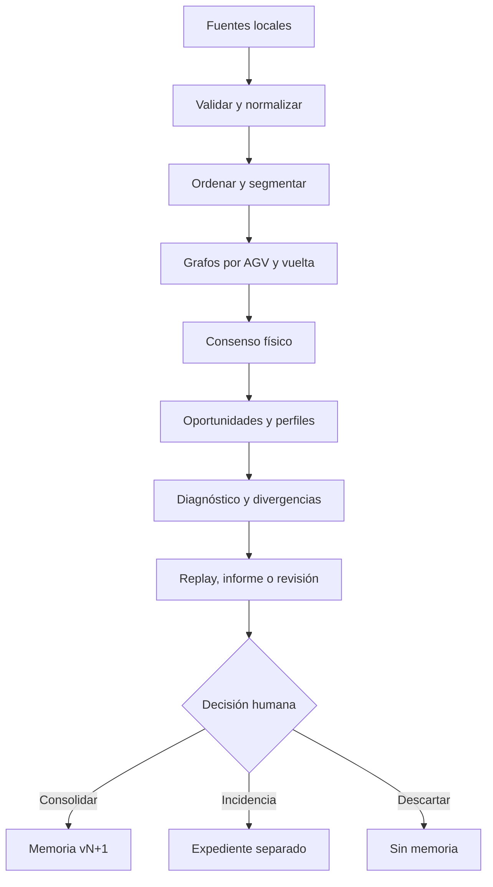

# Catálogo de algoritmos

## 1. Estrategia

El motor inicial será híbrido y explicable: reglas industriales, máquinas de estados, grafos/secuencias, estadística robusta y comparación histórica. No se necesita una IA opaca para crear valor en el piloto.

Cada ejecución registra:

- versión de aplicación;
- versiones de algoritmos y parámetros;
- versiones de configuración, calendario, reglas y grafo esperado;
- hashes de fuentes;
- advertencias de calidad;
- hash determinista del resultado semántico.

## 2. Tubería analítica

## 3. Registro de algoritmos

| ID | Acción | Proceso | Salida esperada | Complejidad objetivo | Fase |
|---|---|---|---|---|---:|
| ALG-001 | Ingesta | Parseo incremental, asignación de columnas y cuarentena | Observaciones normalizadas + informe de calidad | O(n), memoria acotada por lote | F1 |
| ALG-002 | Unión de fuentes | Alineación del tramo contiguo común entre cortes de la misma pila | Vista analítica sin doble cómputo, conservando pasos repetidos legítimos | O(n) esperado | F1 |
| ALG-003 | Afinidad de circuito | Circuito declarado cuando existe; si no, tags, transiciones, AGV y contradicciones | compatible/parcial/ajeno/desconocido | O(n+e) | F1 |
| ALG-004 | Segmentación | Ciclo dominante del cohorte, ancla declarada resuelta por rotación (§7.1) | Vueltas `completa`/`parcial`/`desconocida`, con `truth` dependiente de la ancla y de la completitud | O(n log n) por ordenación; O(n) posterior | F2 |
| ALG-005 | Grafo observado | Conteo de transiciones por AGV/vuelta | Multigrafo trazable | O(n) | F2 |
| ALG-006 | Consenso topológico | Soporte entre AGV/vueltas y estadística robusta | Grafo físico inferido con alternativas | O(e·a) acotado | F2 |
| ALG-007 | Oportunidades | Contexto predecesor/sucesor, ruta y huecos | Oportunidades elegibles, censuradas o desconocidas | O(n)–O(n log n) | F3 |
| ALG-008 | Salud contextual | Lecturas/oportunidades, estabilidad y calidad | Salud + desglose + intervalo/confianza | O(t·a·c) sobre agregados | F3 |
| ALG-009 | Divergencia colectiva | Comparación individual, cohorte, flota e histórico | Individual/grupal/colectiva + explicación | O(m) sobre métricas | F3 |
| ALG-010 | Perfil temporal | Mediana, cuantiles, MAD y calendario | Esperado por tramo/contexto | O(n log n), optimizable | F3 |
| ALG-011 | FIFO/flujo | Tramos de zona cargada derivados del anillo, inversión de orden con margen dual (§8.1) | Adelantamientos candidatos, nunca averías confirmadas | O(n) | F3 |
| ALG-012 | Carga online | Máquina de estados por cada calle configurada | Entradas, ocupación, permanencia, salidas y anomalías | O(n) | F3 |
| ALG-013 | Puntos críticos | Llegadas frente a takt/calendario y causas aguas arriba | Ventanas de riesgo e impacto | O(n) | F3 |
| ALG-014 | Consolidación | Reducción versionada y cálculo de delta | Nueva memoria compacta append-only | O(m), no O(histórico bruto) | F4 |
| ALG-015 | Retroceso causal | Búsqueda temporal/topológica hacia atrás | Cadena de hechos e hipótesis alternativas | Limitada a ventana/subgrafo | F5 |
| ALG-016 | Replay multi-AGV | Estado observado/inferido por instante | Movimiento sobre grafo con incertidumbre | Precálculo + consulta incremental | F5 |
| ALG-017 | Similitud de casos | Características explicables de incidencias | Casos comparables y diferencias | O(k·d) | F5 |
| ALG-018 | Expediente por objeto | Agregación por AGV o por tag y contraste con su cohorte | Recuentos, tags leídos y no leídos, contraparte que sí leyó, y evidencia navegable | O(n) sobre agregados | F2 reducido, F3 completo |
| ALG-019 | Inactividad e instante de cambio | Detección de silencios por objeto y del punto donde el comportamiento cambia | Periodos de inactividad clasificados e instante de cambio con alternativas | O(n) por objeto | F2 reducido, F3 completo |
| ALG-020 | Rotura y degradación de tasa de lectura | Segmentación binaria de un corte, después caída monótona por tramos | Instante de rotura o tendencia sostenida, por tag y por AGV | O(n) sobre la línea de pasadas | F3 |
| ALG-021 | Candidatos a punto crítico | Reparto de sucesores con cuota comparable, sostenida en el tiempo (bifurcación) | Candidatos por clase con evidencia y soporte, nunca asignación | O(n) | F3 |

## 4. Oportunidades y salud

Una oportunidad para el tag `t` existe solo si el recorrido aporta contexto suficiente: predecesor, sucesor, ruta alternativa, ventana temporal y estado del circuito. El resultado puede ser:

- `eligible-read`: oportunidad válida de lectura;
- `suppressed-repeat-possible`: el lector pudo omitir una repetición;
- `censored-gap`: faltan comunicaciones/evidencia;
- `route-not-taken`: el AGV no pasó por ese ramal;
- `unknown`: no se puede decidir.

La tasa básica, usada solo sobre oportunidades elegibles, es:

\[
R_{tag,agv,contexto}=\frac{lecturas\ observadas}{oportunidades\ elegibles}
\]

La salud publicada no será solo `R`. Incorporará estabilidad temporal, acuerdo con pares, calidad de datos y criticidad, mostrando cada componente por separado. Los pesos no se fijan hasta calibración con casos de oro.

El multicircuito vigente forma parte del contexto de la oportunidad, porque puede alterar las
condiciones físicas de detección: bajo un multicircuito de alcance reducido una ausencia es
esperable y no debe contar como degradación. Cuando la fuente no aporta el multicircuito, la salud
del periodo se publica con el confusor declarado, no como si el contexto fuera homogéneo.

## 4.1 Resolución de la fuente y análisis temporal

Cada fuente declara su resolución temporal y el análisis se ajusta a ella. Una transición cuyo
intervalo observado cae por debajo de la resolución **no tiene tiempo medible**: es `observed` en
secuencia y `unknown` en tiempo. Agregar esos ceros produciría medianas y dispersiones falsas.

En la práctica esto separa dos familias:

- **Fenómenos lentos** —permanencia en calles CO, intervalos en puntos críticos, huecos— donde el
  tiempo es varias veces la resolución y la estadística robusta es válida.
- **Transiciones rápidas**, donde solo el orden es utilizable mientras la fuente no aporte más
  resolución.

Una fuente de mayor resolución no invalida los análisis anteriores: cambia lo que es lícito medir a
partir de ella, y eso queda registrado con el resultado.

## 4.2 Inactividad e instante de cambio

Un AGV detenido **no emite lecturas** (R-AGV-006). La consecuencia es incómoda y hay que asumirla:
la inactividad real, el fallo de comunicación y la salida del circuito producen exactamente el mismo
dato, que es la ausencia de dato. No se distinguen mirando el silencio, sino su contexto.

ALG-019 clasifica cada silencio de un objeto usando cinco discriminantes, en este orden:

1. **Cobertura.** Si el intervalo cae fuera de lo cargado, es `sin datos cargados` y el análisis
   termina ahí (R-DAT-007). Ninguna de las hipótesis siguientes llega a plantearse.
2. **Contexto colectivo.** Si el resto de la flota sigue emitiendo con normalidad, el silencio es
   propio del objeto. Si callan muchos a la vez, apunta a infraestructura, proceso o parada
   (R-COM-003, R-FLO-005).
3. **Punto de la última lectura.** Dónde calló discrimina más que cuánto calló: el final de una
   calle de carga, una zona de mantenimiento o un punto intermedio del recorrido productivo
   sugieren hipótesis distintas.
4. **Calendario.** Un silencio que coincide con una parada prevista no es una anomalía.
5. **Forma de la reaparición.** Los cuatro anteriores miran hacia atrás y hacia los lados. Este
   mira hacia delante, y es el único que puede elevar un silencio de `unknown` a una inferencia
   con soporte. Ver §4.3.

La salida es un periodo de inactividad con hipótesis ordenadas y su evidencia, nunca una causa
única. El **instante de cambio** se sitúa en la última lectura antes del silencio, y se marca como
`inferred`: es el último momento del que hay evidencia, no el instante en que el objeto dejó de
funcionar, que puede ser posterior y desconocido.

Para un tag, el mismo algoritmo responde otra pregunta: desde cuándo dejó de leerlo **cada** AGV.
Que un solo AGV deje de leerlo mientras los demás siguen apunta a ese AGV o su lector; que dejen
todos a la vez apunta al tag, a su ubicación o a un cambio físico (R-GRA-005).

## 4.3 Firmas de reaparición

Cómo vuelve un objeto informa tanto como cómo se fue. Dos firmas están identificadas.

### Firma de carga online

La última lectura antes del silencio es el tag de parada de una calle CO **configurada**, y la
reanudación recorre en orden la secuencia de tags declarada para esa calle y las posteriores.

No es una corazonada: la secuencia está en la configuración (DS-004), así que la firma se comprueba
contra un valor declarado, no contra una expectativa del algoritmo. Salida: `en carga online`,
estado `inferred`, con la calle identificada y el grado de coincidencia de la secuencia.

Degradación explícita: sin calles CO configuradas la firma **no puede reconocerse**, y el silencio
permanece `unknown` declarando esa razón. No se sustituye por una heurística de proximidad.

### Firma de hueco conservado

El objeto desaparece y reaparece manteniendo su posición relativa entre los mismos vecinos, sin
intercambio de AGV. Es R-OPP-004 aplicado al expediente de un objeto.

La reaparición se busca **hacia delante en el tiempo**: no es volver a verlo en el mismo instante,
sino más tarde, y lo que discrimina es qué hicieron sus vecinos durante ese intervalo.

Demuestra una cosa concreta: **permaneció en el circuito**. Descarta salida y retirada. Lo demás lo
deciden dos contrastes: si los vecinos avanzaron, y cuánto se aparta el tiempo del esperado para ese
tramo.

| El objeto | Sus vecinos en la misma ventana | Tiempo frente al esperado del tramo | Lectura prioritaria |
|---|---|---|---|
| Reaparece conservando posición | **Tampoco avanzaron** | — | Fallo **colectivo**: la línea está detenida. No es de este objeto, y buscarle causa propia sería un error |
| Reaparece conservando posición | Avanzaron con normalidad | Muy por encima del esperado | Fallo **individual**: estuvo detenido de forma anómala |
| Reaparece más adelante, coherente con el grupo | Avanzaron lo esperado | Dentro de lo normal | Circuló **sin ser leído**: lector o comunicación |
| Reaparece siguiendo la secuencia de una calle CO | — | — | Firma de carga online, que se comprueba antes que las demás |

Que los vecinos tampoco avanzaran es la señal que separa un vehículo averiado de una línea parada,
y tiene prioridad sobre las demás: es R-FLO-005 leído desde el expediente de un objeto. Si el que va
delante tampoco se movió, la causa está aguas arriba y atribuirla a este objeto sería un falso
diagnóstico individual.

**Dónde vale esta firma.** El vecindario se deriva del orden relativo, que solo es estable donde
está garantizado. En zona cargada se espera FIFO (R-FLO-001) y la firma es fuerte. En zona vacía se
admite reordenación (R-FLO-002), así que el vecindario es débil y la firma baja de confianza en
lugar de aplicarse igual. Una calle CO queda fuera del FIFO cargado (R-FLO-003), y por eso su firma
se comprueba primero: entrar a cargar es una salida legítima del orden, no una anomalía.

**El exceso de tiempo sí es medible.** Aunque a resolución gruesa la mayoría de las transiciones no
tiene tiempo observable (§4.1), estas detenciones duran varias veces la resolución. La firma vive
precisamente en la banda que sí se puede medir. El esperado del tramo es robusto —mediana y
dispersión de ALG-010— y el factor que hace «bastante» un exceso es configuración con vigencia.

Ambas firmas producen inferencias, nunca observaciones: no se crea ninguna lectura para rellenar el
silencio (R-EVI-002).

### El umbral no es un número

La duración que hace significativo un silencio es configuración con vigencia y se expresa **relativa
al ciclo local del tramo**, no en minutos absolutos (R-OPP-006, R-FLO-004). El mismo silencio puede
ser normal en un tramo y anómalo en otro, y ninguna cifra de referencia se fija en el código.

### Sexto discriminante: reaparecer donde el circuito no llega

Los cinco anteriores miran hacia atrás, hacia los lados y hacia delante **dentro** del circuito.
Ninguno contempla que el objeto se haya ido a otro.

Si el par (último tag antes del silencio → primer tag después) es una transición que sus vecinos de
circuito también hacen, el objeto estuvo **ahí parado**. Hasta ahí es barato. Lo que **no** vale es
el recíproco, y darlo por bueno fue un error de este catálogo: que ningún vecino haga ese salto no
demuestra que el objeto se fuera, demuestra que **dejó de leer**. Un vehículo que recorre su propia
línea sin registrar catorce tags reaparece dando un salto que nadie más da, sin haberse movido.

La comprobación completa tiene dos partes, y la segunda es la que decide (R-AGV-012):

1. ¿Se alcanza el tag de reanudación siguiendo la línea desde donde desapareció? Si no, no se llega
   desde ahí y la salida se sostiene.
2. Si se alcanza, ¿cuánto tardó frente a lo que tarda el cohorte **por ese mismo tramo, medido de
   extremo a extremo**? Dentro de su rango, el objeto estuvo ahí y lo que hay es un tramo recorrido
   sin leer. Solo por encima se sostiene que estuvo en otro sitio.

La comparación va contra el recorrido medido, nunca contra la suma de tiempos de cada arista: donde
la carga se hace en ruta, un tramo con parada de trabajo tiene una dispersión tal que cualquier
umbral sobre la suma dispara solo. Releer el mismo tag tampoco es ir a ninguna parte.

Medido sobre una exportación real de tres circuitos, la diferencia entre aplicar solo el primer
criterio y aplicar los dos es la diferencia entre un diagnóstico y un falso positivo: el vehículo
que parecía irse cinco veces no se va **ninguna**. Lo que tiene son cuatro tramos recorridos sin
leer, cuarenta tags en total, frente a cero o catorce de sus trece compañeros. Sigue siendo el
vehículo anómalo de la exportación, pero por lectura y no por trayecto, y el hallazgo que se le
atribuya cambia entero.

Un corolario que hay que aplicar antes que nada de lo anterior: **dos lecturas en el mismo instante
no ordenan nada** (R-DAT-013). Su orden es posición de pila, no medida del reloj, así que aparecen
en las dos direcciones y la minoritaria simula un desvío que nunca ocurrió. Antes de discriminar
nada, esas aristas se retiran del razonamiento topológico.

**Y salir del circuito no es una reubicación benigna: es una anomalía por diseño.** Los cruces
llevan un par de tags de protección precisamente para detener a un vehículo que se desvía, así que
un objeto que se fue significa que algo no funcionó. Las hipótesis son enumerables:

| Evidencia en las lecturas | Hipótesis |
|---|---|
| los tags de protección aparecen y salió igual | la lectura funcionó; la orden no se ejecutó |
| los tags de protección no aparecen | falló la lectura de la protección |
| salió antes del segundo tag del par | se desvió entre uno y otro |

Ambas ramas son `inferred` y se presentan con su evidencia, nunca como causa única. Lo que sigue sin
ser medible es la **ausencia de lecturas mientras está fuera**; el hallazgo es la salida, no el
silencio — son dos cosas distintas y conviene no mezclarlas.

Cruzar exportaciones **no** confirma dónde estuvo: si el vehículo no lleva en memoria los tags del
circuito de destino, no aparece en su exportación (R-OPP-009).

## 4.4 Rotura súbita y degradación progresiva (R-OPP-015)

La matriz de lectura de R-OPP-013 resume cada par (tag, AGV) en una tasa sobre toda la ventana, y
esa tasa es ciega al **cuándo**: un tag que se lee al 100 % y desaparece de golpe a mitad de la
ventana sale con el mismo aspecto que uno que siempre estuvo a la mitad. ALG-020 mira la misma
evidencia —pasadas probadas, con acierto o sin él (R-OPP-014)— pero ordenada en el tiempo.

**Es una segunda mirada sobre lo ya calculado, no una relectura de la fuente.** La primera pasada es
el mismo recorrido que ya construye la matriz; lo único que cambia es que, además de sumar a un
contador, se retiene el instante de cada pasada probada en una línea temporal por tag y por AGV. La
segunda pasada es un post-proceso barato sobre esas líneas, del orden de las lecturas totales.

Dos vías, en este orden y sin mezclarlas —el mismo principio que R-OPP-014 aplica a vecinos/tiempo/
orden—:

1. **Rotura súbita.** Segmentación binaria de un único corte: se prueba cada punto de la línea y se
   queda el que maximiza la diferencia de tasa entre lo de antes y lo de después. El instante que se
   publica es el punto medio entre la última pasada de antes y la primera de después —no se puede
   precisar más—, y solo cuenta si la caída supera un umbral generoso (el caso de manual es
   100 % → 0 %).
2. **Degradación progresiva**, solo si no hubo rotura. La línea se divide en tramos **por recuento**,
   no por tiempo —la densidad de pasadas no es uniforme—, y cuenta si la tasa de cada tramo no crece
   nunca respecto al anterior y la caída entre el primero y el último supera un umbral propio.

**El corte tiene que representar una fracción real de la línea, no solo un recuento.** Con líneas
largas, una racha corta de mala suerte al final —cinco pasadas sin acierto entre quinientas— puede
parecer un corte más brusco que una tendencia real repartida por toda la ventana. El mínimo a cada
lado del corte se exige tanto en número absoluto como en proporción de la línea.

**Un AGV se examina igual, sobre su propia línea.** Todas sus pasadas probadas, en cualquier tag,
ordenadas en el tiempo: un lector que falla cada vez más lo hace en varios tags a la vez, y su
propia línea lo muestra sin que haga falta mirar tag por tag. Lo que no puede pasar es que ese
hallazgo se traslade a los tags que lee: si el resto de la flota los sigue leyendo con normalidad,
esos tags no llevan ni corte ni tendencia — es un riesgo real, no teórico: un tag `bimodal-candidato`
mezcla en una sola línea temporal los aciertos de quien siempre lo lee y los fallos de quien nunca lo
lee, y si esas dos poblaciones estuvieran agrupadas por bloques de tiempo en vez de entrelazadas, un
corte binario las confundiría con una rotura.

## 5. Estadística robusta

- Mediana y cuantiles para tiempos de tramo/permanencia.
- MAD o IQR para dispersión, evitando que una parada sesgue el esperado.
- Soporte mínimo por contexto antes de crear un perfil.
- Intervalos y tamaño de muestra visibles.
- Separación por calendario, zona, configuración y cohortes cuando exista evidencia de comportamiento distinto.

No se usará una media global que mezcle operación, pausa, parada, incidencia o versiones incompatibles.

## 6. Consenso y divergencia

El consenso conserva tanto la ruta dominante como alternativas con soporte. Una diferencia se clasifica inicialmente como:

| Patrón | Hipótesis prioritaria | No permite afirmar por sí solo |
|---|---|---|
| Un AGV diverge | AGV, lector o memoria/configuración | Tag físico defectuoso |
| Pocos AGV coherentes entre sí | Cohorte/configuración no actualizada | Cambio del circuito completo |
| Mayoría de AGV en un tag/tramo | Tag, ubicación, infraestructura o cambio físico | Causa exacta |
| Muchos AGV simultáneamente | Comunicación, proceso, saturación o calendario | Fallos independientes |
| Todos cambian de secuencia sostenidamente | Evolución física/configurada | Que Vsystem sea necesariamente incorrecto |

Cada diagnóstico conserva explicaciones alternativas y acciones de comprobación.

## 7. Segmentación de vueltas y huecos

Las vueltas se detectarán con anclas configurables, repetición de secuencias, dirección y límites temporales. Si el corte es incierto se conserva `partial-lap` o `unknown`; no se fuerza una vuelta completa.

## 7.1 Ancla de vuelta: ciclo dominante o declarada, implementado (R-GRA-009)

La topología —qué tags forman el anillo y en qué orden— la da siempre el tráfico observado:
`findDominantCycle` sigue el sucesor mayoritario de cada tag hasta que uno se repite, y ese primer
repetido es el ancla. Sin ninguna ancla declarada, esa es la única disponible, y una vuelta cortada
por ella **nunca es `observed`**, aunque los datos sean perfectos: es una propiedad estadística del
tráfico, no un punto de referencia conocido.

Una ancla declarada (`CONFIG_SCHEMA.md` §3.4.2, lista `ancla`) no recalcula esa topología: solo
**rota** el mismo ciclo para que empiece en el tag declarado. `resolveDeclaredAnchor` prueba cada
ancla de la lista, en orden de prioridad, contra el ciclo ya reconstruido, y se queda con la primera
que aparece. Ninguna presente deja el mecanismo tal como estaba, con su problema declarado en vez de
inventar un corte que el dato no sostiene.

**El `truth` de una vuelta depende de dos cosas, no de una.** Una vuelta `completa` con ancla
declarada y resuelta sí pasa a `observed`: sus dos extremos son el mismo punto de referencia conocido.
Una vuelta `parcial` **nunca** lo es, declarada o no la ancla: por definición uno de sus dos extremos
es un corte de los datos —el borde de la cobertura o el principio/final de lo importado—, no el
ancla, y declararla `observed` ahí inventaría una certeza que el dato no sostiene. Una vuelta
`desconocida` (el vehículo nunca pasa por el ancla) se queda `unknown` en cualquier caso: no pasar
nunca por el punto de referencia no se resuelve declarándolo con más fuerza.

**Lo que esto no hace.** No implementa ninguna «confianza mínima» sobre el ancla: la propia
`CONFIG_SCHEMA.md` no definía qué significaría, y no hay valores de planta que la motiven. Tampoco
recalcula el ciclo a partir del ancla declarada — si esta no aparece en el ciclo reconstruido, el
problema se declara y se sigue con el ancla inferida.

Para un hueco:

1. comprobar comunicaciones y densidad colectiva;
2. comparar AGV anterior/posterior y orden relativo;
3. evaluar continuidad topológica y tiempo plausible;
4. buscar eventos de mantenimiento/asistencia o cambio de ruta;
5. asignar estado y confianza.

## 8. FIFO y carga online

FIFO se evalúa como orden relativo dentro de límites versionados de zona cargada. La zona vacía, CO y movimientos manuales son contextos distintos. Cada calle CO configurada usa estados:

`unknown → approaching → entering → occupied → leaving → clear`, con transiciones incompletas permitidas y señaladas.

No se calcula salud de carga con SOC. Se analizan secuencias, ocupación, permanencia, rotación, ausencia de entrada/salida y relación con comunicación.

## 8.1 FIFO en zona cargada, implementado (R-FLO-001)

Los tramos no se configuran: se derivan. Cada tag ya declara su zona (`vacio`/`cargado`, lista
`zona`); un tramo es una tira contigua máxima de tags cargados a lo largo del anillo, con su entrada
y su salida en los dos extremos. El recorrido arranca desde cualquier posición no cargada, para que
un tramo que cruza el índice 0 del array del anillo se camine entero sin partirse en dos. Un tramo de
un solo tag se descarta y se declara: no distingue entrada de salida con una sola lectura.

Dentro de cada tramo, las lecturas de cada vehículo en la entrada y la salida se emparejan en
pasadas —la misma máquina de dos paradas que ya usa la carga online (§8), sin la parada intermedia—,
honesta con lo que no encaja: una entrada sin salida antes de otra entrada queda `incompleta`, una
salida sin entrada previa que es la primera lectura del vehículo en ese tramo queda `abierta al
inicio`, y una pasada que no cierra antes de acabar la cobertura queda `abierta al final`. Solo las
pasadas `completa` alimentan el detector.

**Detección: la misma inversión de orden que R-CO-003, con una guarda que R-CO-003 no necesita.**
Sobre pasadas ordenadas por instante de entrada, un vehículo B adelanta a A si entró después y salió
antes. En una calle de carga, cualquier inversión así es señal fuerte porque hay una cola física real
detrás. Un tramo de zona cargada es tránsito abierto: dos vehículos sanos muestran pequeñas
diferencias de orden por el jitter normal de lectura, y un vehículo que vuelve de cargar —una de las
excepciones que la propia R-FLO-001 nombra— reaparece con una fase nueva frente a sus antiguos
vecinos, lo que puede producir una inversión grande y enteramente inocente. Por eso el adelantamiento
exige un margen mínimo en las dos puntas —al entrar y al salir—, el mayor entre un piso absoluto y
una fracción del tránsito mediano **del propio tramo** (R-FLO-004: cuánto tarda un tramo cargado es
local, no una constante universal). Si el margen no se sostiene en ambos extremos, no hay
adelantamiento que publicar: admitirlo fabricaría el mismo hallazgo con otro nombre.

**Lo que esto no hace.** No cruza con la carga online para descartar automáticamente los
adelantamientos causados por una parada de carga real, la misma limitación que R-CO-003 ya acepta
hoy. No concluye causa: OQ-107 sigue sin el catálogo de excepciones legítimas (carga online,
maniobra manual, excepción documentada), así que lo que se publica son candidatos.

## 8.2 Candidatos a punto crítico (R-GRA-007)

Distinto de §9: esto no compara llegadas contra takt ni calendario —ALG-013 sigue bloqueado por
OQ-108—, es la mitad de R-GRA-007 que no necesita ninguno de los dos: proponer **candidatos** a tag
crítico por la firma que deja cada clase en el dato, nunca asignar la función.

De las siete clases de `CONFIG_SCHEMA.md` §3.4.1, dos no dejan firma (`cambio-de-mapa`, y un `cruce`
que nadie ha fallado en un solo circuito), y esta entrega construye solo la de **bifurcación**: un
tag cuyas salidas se reparten entre dos o más sucesores con cuota comparable, ninguno dominante. Es
el mismo recuento de sucesores por tag que `findDominantCycle` ya reduce para encontrar el sucesor
mayoritario — la diferencia es que aquí interesan los que **no** llegan a dominar.

**Guarda dual de cuota y soporte**, mismo principio que `GraphThresholds` y que el margen de FIFO:
cada rama exige una cuota mínima (una excepción rara del 5 % no es reparto) **y** un soporte mínimo
(un 50/50 sobre dos pasadas no es consenso).

**Guarda de persistencia temporal, encontrada auditando el propio detector.** Con solo la guarda de
cuota y soporte, un tag justo antes de una rotura súbita aguas abajo sale como bifurcación falsa: casi
todas sus salidas van al sucesor de siempre antes de la rotura y al que lo sustituye —saltando el
tramo roto— después, y esas dos cuotas agregadas sobre toda la ventana pueden ser perfectamente
comparables sin que exista ningún reparto real. La guarda exige que cada rama se sostenga, por
recuento y no por tiempo, en las dos mitades de las pasadas del tag: una bifurcación real persiste en
las dos; un cambio de régimen desaparece en una.

**Lo que esto no hace.** No construye `parada-precisa`, `semáforo` ni `cruce`: las dos primeras
necesitan una firma de tiempo de permanencia que no existe todavía, y `cruce` resultó ser un problema
distinto —`assignCohorts` fusiona dos vehículos en un cohorte en cuanto comparten una sola
transición, así que un cruce real entre circuitos no sobrevive como dos cohortes unidos por una
arista rara: se fusiona, y la bifurcación resultante queda indistinguible de una normal sin una
comprobación de reconvergencia que esta entrega no construye—. Tampoco comprueba que las ramas de una
bifurcación candidata se reencuentren más adelante. OQ-122 queda Parcial, no cerrada.

## 9. Punto crítico y análisis temporal

Las llegadas se comparan con el takt y calendario vigentes. Un intervalo sin llegada —por ejemplo diez minutos— activa la búsqueda hacia atrás sobre:

- alimentación del tramo;
- orden FIFO y acumulación;
- estados de CO;
- silencios colectivos;
- AGV divergentes;
- cambios respecto al esperado de ese horario.

El informe distingue correlación, secuencia causal plausible y causa confirmada.

## 10. Mejoras posteriores

Solo tras disponer de etiquetas humanas y métricas de precisión se considerarán:

- detección no supervisada de patrones nuevos;
- modelos supervisados para priorizar hipótesis;
- predicción temprana de saturación;
- aprendizaje de embeddings de incidencias.

Todo modelo será candidato en sombra, comparado con el algoritmo estable, explicable en sus entradas y sin alterar históricos consolidados.
