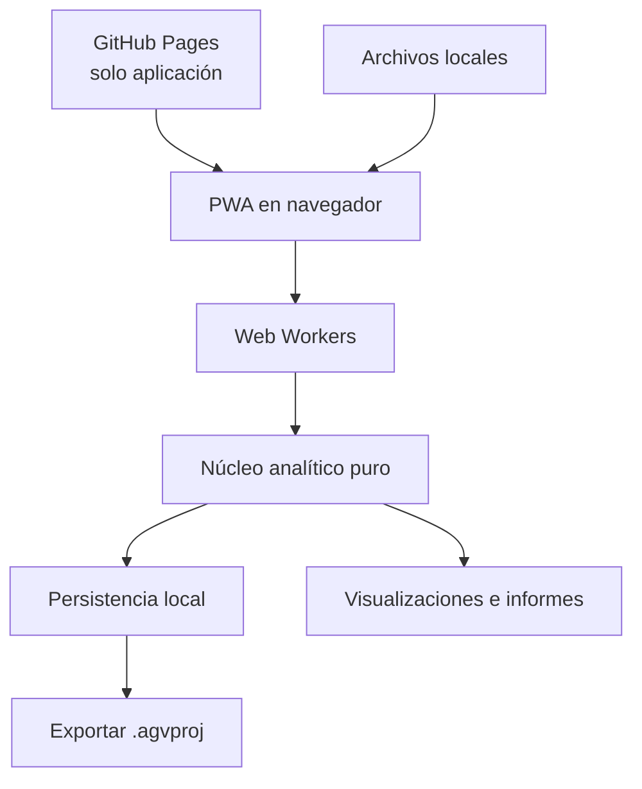
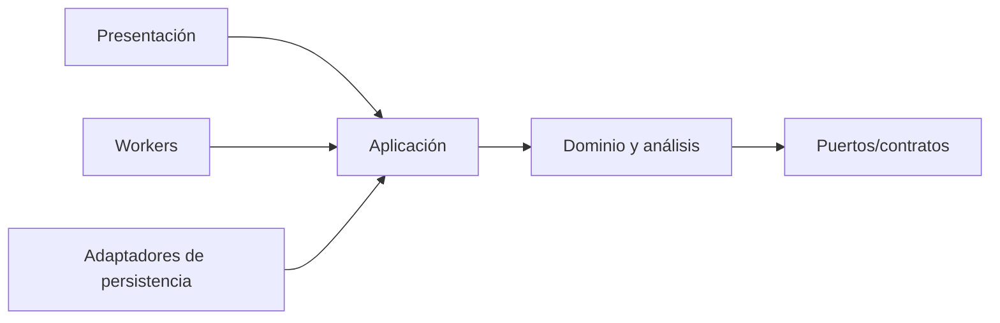

# Arquitectura

## 1. Decisión de alto nivel

TAG TRACE será una aplicación web estática/PWA servida desde GitHub Pages. El navegador descarga el código, pero los datos industriales se importan, procesan y persisten localmente. No existe backend de análisis ni sincronización automática.



## 2. Contextos separados

| Contexto | Responsabilidad | No conoce |
|---|---|---|
| `domain` | Entidades, estados, invariantes y reglas puras | DOM, archivos, IndexedDB, Worker |
| `ingestion` | Parseo, validación, normalización y procedencia | Visualización |
| `topology` | Vueltas, secuencias, grafos y consenso | Persistencia concreta |
| `analysis` | Oportunidades, salud, divergencias, FIFO, CO y críticos | Componentes UI |
| `incidents` | Retroceso, replay, casos y contramedidas | Memoria normal mutable |
| `consolidation` | Propuesta y evento append-only | Confirmación automática |
| `application` | Orquesta casos de uso y cancelación | Detalles de renderizado |
| `workers` | Ejecuta trabajos pesados y comunica progreso | Reglas industriales propias |
| `persistence` | Proyectos, migraciones e integridad | Algoritmos de negocio |
| `presentation` | Vistas, interacción, accesibilidad | Cálculos duplicados |

## 3. Dependencias permitidas



El núcleo no importa React, APIs del navegador, almacenamiento ni librerías gráficas. Esto permite probar algoritmos sin navegador y cambiar interfaz/persistencia sin reescribir el diagnóstico.

## 4. Flujo de datos

1. La UI entrega `File` al coordinador.
2. Un Worker calcula hash y procesa por bloques.
3. La normalización produce columnas compactas y un registro de procedencia.
4. Las etapas analíticas consumen resultados anteriores sin duplicarlos innecesariamente.
5. El Worker publica progreso, métricas y resultados parciales serializables.
6. La UI conserva solo lo necesario para la vista actual.
7. Consolidación/persistencia escribe una nueva versión transaccional.

## 5. Memoria de ejecución

Reglas arquitectónicas:

- Parseo incremental; evitar `split` completo de archivos grandes.
- Representación columnar, diccionarios de IDs y arrays tipados cuando las mediciones lo justifiquen.
- Transferir buffers entre Worker y UI en lugar de clonarlos.
- Índices creados por necesidad y liberados al terminar una etapa.
- Agregados por contexto, no objetos JS repetidos por evento.
- Replay calculado por puntos de cambio; no guardar una posición por AGV y fotograma.
- Cancelación cooperativa con puntos de control deterministas.
- Resultados parciales marcados como incompletos y nunca consolidables.

## 6. Persistencia

Se definirá una interfaz de repositorio local. Implementación candidata:

- IndexedDB para manifiestos, configuraciones, índices y objetos versionados.
- OPFS, si las pruebas de compatibilidad/rendimiento justifican su uso, para bloques grandes locales.
- `.agvproj` como formato portable independiente del almacenamiento interno.

No se fijará DuckDB-Wasm ni otra base embebida hasta demostrar, mediante benchmark, una reducción neta de complejidad o recursos.

## 7. Stack candidato

| Área | Candidato | Estado |
|---|---|---|
| Lenguaje | TypeScript estricto | Proposed, alta preferencia |
| Build/PWA | Vite + plugin PWA evaluado | Proposed |
| UI | React o alternativa ligera tras prototipo de rendimiento | Open |
| Unitarias | Vitest | Proposed |
| E2E | Playwright | Proposed |
| Grafos | Canvas/WebGL o librería encapsulada | Open |
| Persistencia | IndexedDB; OPFS opcional | Proposed |
| CI/CD | GitHub Actions + GitHub Pages | Accepted conceptualmente |

Toda dependencia se fija mediante lockfile, se audita y se encapsula cuando pueda condicionar el dominio.

## 8. Estructura futura

```text
src/
  domain/
  ingestion/
  topology/
  analysis/
  incidents/
  consolidation/
  application/
  persistence/
  presentation/
workers/
schemas/
fixtures/synthetic/
tests/
  unit/
  property/
  golden/
  integration/
  e2e/
  performance/
```

La estructura se crea en F1, no en esta línea base documental.

## 9. Determinismo

Los algoritmos no consultan reloj, red, orden no estable ni aleatoriedad sin semilla. El hash semántico excluye únicamente metadatos declarados no deterministas. Una reproducción conserva exactamente entrada, configuración, calendario, reglas y versiones.

## 10. Publicación y actualización

- Solo una compilación aprobada se despliega desde `main`.
- La publicación contiene código y fixtures sintéticos, nunca datos locales.
- El Service Worker no activa una versión mientras haya una operación crítica.
- Cada release incluye identificador visible y posibilidad de volver a la compilación anterior.
- La futura aplicación no dependerá en ejecución de CDN de terceros.
