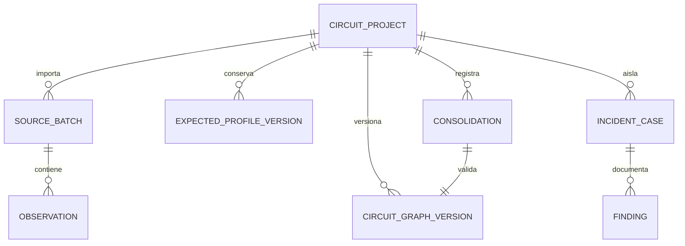
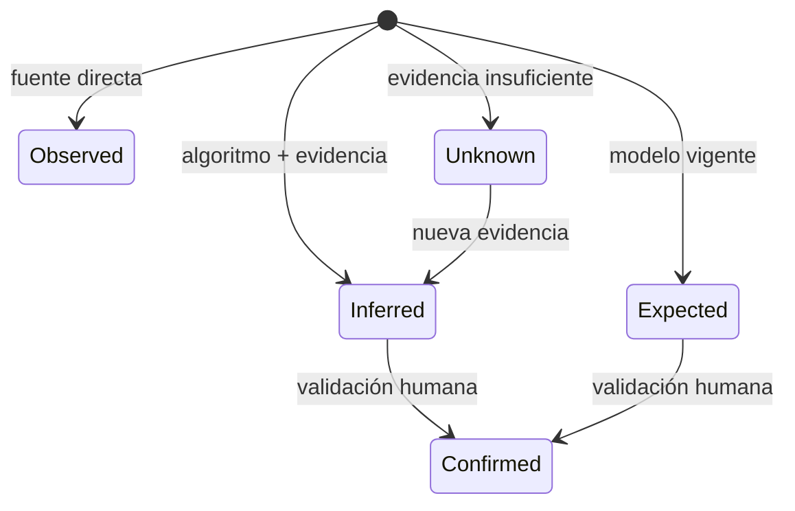

# Modelo de dominio

## Agregados principales

### CircuitProject

Raíz de aislamiento. Contiene identidad del circuito, configuraciones versionadas, catálogo parcial, memoria consolidada, expedientes de incidencia y referencias a fuentes. Ningún objeto operativo puede pertenecer implícitamente a dos circuitos.

### SourceBatch

Fuente importada con `source_id`, tipo, nombre local sanitizado, hash, tamaño, periodo, esquema detectado, zona horaria, recuentos, advertencias y estado de aceptación. El contenido bruto permanece inmutable durante la sesión.

### Observation

Evento normalizado que conserva:

- `timestamp` y representación original;
- `agv_id` y `tag_id` como texto;
- atributos disponibles sin inventar campos ausentes;
- `source_id`, número de fila y hash;
- estado `observed`.

### CircuitGraphVersion

Versión de nodos y transiciones con procedencia:

- teórica/configurada;
- observada en un periodo;
- inferida por algoritmo;
- validada mediante consolidación.

Cada arista conserva soporte, AGV participantes, primera/última observación, distribución robusta de tiempo, contextos y confianza.

### ExpectedProfileVersion

Describe el comportamiento esperado para un contexto: vigencia, calendario, turno, pausa, estado de proceso, zona, tipo de AGV/configuración y versión del grafo. No es un promedio universal.

### Finding

Conclusión provisional o aceptada con:

- categoría y objeto afectado;
- estado de verdad;
- evidencia a favor y en contra;
- algoritmo/regla y versión;
- confianza e impacto separados;
- diagnósticos alternativos;
- comprobación recomendada;
- disposición: pendiente, aceptado, rechazado, excluido o vinculado a incidencia.

### Consolidation

Evento append-only que transforma un análisis revisado en una nueva versión de memoria. Registra autor, instante, periodo, fuentes, configuración, algoritmos, inclusiones/exclusiones, justificaciones, hash anterior y hash resultante.

### IncidentCase

Expediente separado con síntoma, intervalo y márgenes, eventos normalizados necesarios para el replay, esperado aplicable, divergencias, hipótesis, evidencia, contramedidas y verificaciones.

## Relaciones

## Máquina de estados de evidencia

Una entidad puede evolucionar de hipótesis a confirmación, pero nunca se reescribe su procedencia:

`confirmed` añade una decisión humana; no convierte retrospectivamente una inferencia en lectura observada.

## Contextos que no deben mezclarse

- Circuitos diferentes.
- Zona cargada y zona vacía.
- Operación normal, pausas, parada planificada e incidencia.
- Versiones de configuración distintas.
- Familias de AGV/lector cuando su comportamiento difiera materialmente.
- Lectura directa e inferencia.
- Mantenimiento/asistencia y recorrido productivo.
