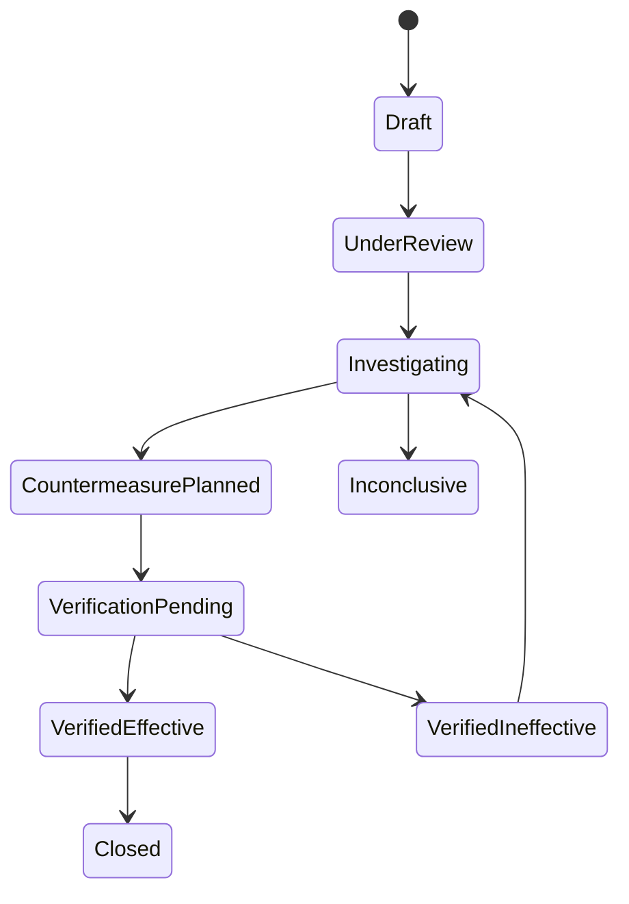

# Incidencias, replay e informes

## 1. Propósito

Una incidencia conserva un comportamiento anormal para investigarlo, compararlo, aplicar contramedidas y verificar su evolución, sin convertirlo en comportamiento normal del circuito.

## 2. Creación

Puede comenzar desde:

- un intervalo seleccionado;
- un hallazgo;
- un punto crítico sin alimentación;
- una divergencia de AGV/tag/tramo;
- una anomalía de FIFO o CO;
- un síntoma descrito manualmente.

El usuario define el instante/intervalo del síntoma y el sistema propone márgenes antes y después, modificables.

## 3. Contenido del expediente

| Grupo | Campos mínimos |
|---|---|
| Identidad | `incident_id`, circuito, título, estado, autor y fechas |
| Síntoma | qué ocurrió, dónde, cuándo, impacto y fuente del aviso |
| Contexto | calendario, turno, takt, configuración, grafo y algoritmos vigentes |
| Evidencia | fuentes/hash/filas, recorte normalizado mínimo, calidad y huecos |
| Comparación | observado frente a esperado antes/durante/después |
| Replay | trayectorias observadas/inferidas/desconocidas por AGV |
| Diagnóstico | hallazgos, hipótesis alternativas, confianza y evidencia contraria |
| Casos similares | similitud explicada y diferencias relevantes |
| Contramedidas | acción, responsable, fecha, estado, riesgo y verificación prevista |
| Verificación | periodo posterior, métrica antes/después y conclusión humana |

## 4. Retroceso desde el síntoma

El análisis trabaja hacia atrás en tiempo y topología:

1. fijar el síntoma y su primera evidencia;
2. identificar objetos directamente afectados;
3. buscar la primera desviación respecto al esperado;
4. recorrer tramos y dependencias aguas arriba;
5. comparar AGV afectados con pares no afectados;
6. revisar comunicación, calendario, configuración, FIFO, CO y proceso;
7. construir hipótesis ordenadas con evidencia a favor y en contra;
8. señalar qué comprobación discrimina mejor entre hipótesis.

El orden no representa causalidad demostrada. La interfaz debe distinguir `precede`, `correlaciona`, `es compatible con` y `confirmado como causa`.

## 5. Replay multi-AGV

El replay muestra por instante:

- posición `observed` en un tag;
- posición `inferred` en una arista o zona, con banda de incertidumbre;
- estado `unknown` durante huecos no reconstruibles;
- estado de zonas cargada/vacía, calles CO y puntos críticos;
- capa esperada para el mismo contexto;
- eventos y divergencias sincronizados.

No se dibuja una posición exacta cuando solo se conoce un tramo. El usuario puede filtrar AGV, tag, zona, tipo de evidencia y acelerar/pausar el tiempo.

## 6. Comparación con casos anteriores

La similitud utiliza características explícitas: zona, síntoma, duración, patrón colectivo, AGV/cohorte, tags, secuencia, horario, CO/FIFO y diagnóstico confirmado. El resultado debe explicar coincidencias y diferencias. No puede sugerir que una causa anterior sea la causa actual sin nueva evidencia.

## 7. Estados

Puede cerrarse como `inconclusive` conservando lo aprendido y la evidencia que falta.

## 8. Informe vivo

El informe se regenera desde el expediente y contiene:

1. conclusión ejecutiva;
2. alcance y calidad de datos;
3. cronología antes/durante/después;
4. comportamiento observado frente a esperado;
5. AGV, tags, tramos y sistemas implicados;
6. hipótesis ordenadas y confianza;
7. evidencia y trazabilidad;
8. contramedidas;
9. verificación posterior;
10. versiones de reglas, algoritmos y configuración.

Una exportación es una instantánea; el expediente local continúa vivo. El informe no se publica en GitHub.

## 9. Relación con consolidación

- Crear, guardar o cerrar una incidencia no altera la memoria normal.
- El periodo marcado como incidencia queda excluido del entrenamiento del esperado por defecto.
- Un aprendizaje general puede proponerse posteriormente como cambio de regla/configuración, pero requiere una decisión y consolidación separadas.
