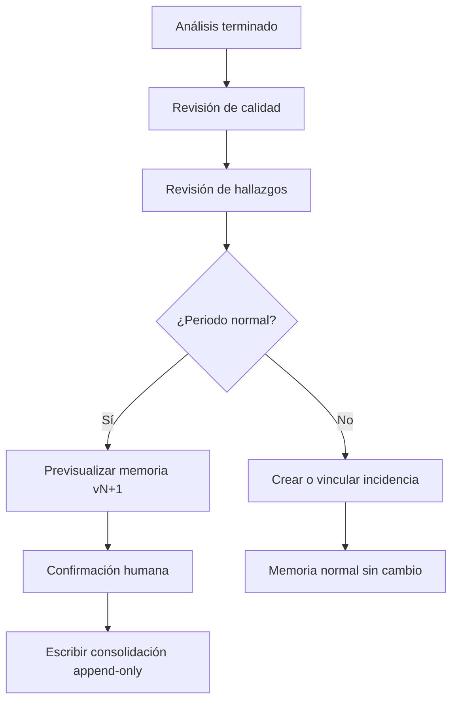

# Memoria longitudinal y consolidación

## 1. Objetivo

Conservar la evolución real del circuito con el mínimo volumen necesario para comparar periodos futuros. La memoria normal no es un archivo de todos los eventos: es una sucesión de estados validados, perfiles y divergencias relevantes.

## 2. Capas de información

| Capa | Contenido | Persistencia por defecto |
|---|---|---|
| Bruto activo | Archivos originales y filas | Solo durante la sesión/análisis; referencia por hash. Las lecturas normalizadas se retienen solo para la última exportación (o dos si se solapan), R-DAT-023 |
| Trabajo | Eventos normalizados, índices y grafos temporales | Temporal, liberable por etapas |
| Resultado | Hallazgos, métricas, grafo del periodo | **Duradera como instantánea** por fichero desde 2026-09-26 (ADR-0015, R-DAT-023): un grafo con fecha de cientos de kilobytes, guardado solo, sin ser memoria consolidada |
| Memoria normal | Estado consolidado y deltas compactos | Duradera en `.agvproj` |
| Incidencias | Recorte mínimo, replay, informe y contramedidas | Duradera pero separada |

## 3. Qué se conserva al consolidar

- Identidad y periodo analizado.
- Hashes y metadatos de las fuentes, no necesariamente su contenido.
- Calidad y cobertura del periodo.
- Configuración, calendario, reglas y algoritmos aplicados.
- Grafo físico validado: nodos, transiciones, soporte y tiempos robustos.
- Perfiles esperados por contexto con tamaño de muestra y dispersión.
- Salud resumida por tag, tramo, AGV y cohorte.
- Divergencias individuales, grupales o colectivas relevantes.
- Cambios respecto a la versión anterior.
- Decisiones humanas: incluido, excluido, corregido, pendiente y justificación.
- Referencias a incidencias, sin incorporarlas al cálculo normal.

## 4. Qué no se conserva por defecto

- Todas las filas brutas.
- Copias duplicadas de datos comunes entre AGV.
- Estados de animación precalculados para cada instante.
- Tablas intermedias reconstruibles.
- Eventos normales repetitivos sin valor diferencial.
- Información de SOC/batería.

## 5. Compresión semántica

Para una transición estable se guarda una sola estructura:

```text
origen, destino, contextos, soporte,
AGV participantes, primera/última observación,
mediana, cuantiles/MAD, confianza y versión
```

Los AGV que coinciden con el consenso apuntan al estado común. Solo se guardan deltas por AGV cuando divergen: qué cambió, desde cuándo, cuánto soporte existe y cuándo volvió a coincidir. Esto evita almacenar el mismo grafo decenas de veces.

## 6. Flujo del botón «Consolidar periodo»



Antes de habilitar el botón deben cumplirse:

- circuito resuelto;
- fuentes aceptadas y hashes calculados;
- calidad suficiente o excepciones justificadas;
- periodo y calendario correctos;
- incidencias separadas o justificadas;
- lista de cambios visible;
- versión anterior disponible;
- posibilidad de cancelar antes de confirmar.

**Revisión de hallazgos (paso C), ya disponible en F3** (`UX_SPEC.md` §4.3, R-EVI-007). Cada
hallazgo queda pendiente, confirmado, descartado o pospuesto, con su nota. Decisión del propietario
(2026-09-23) para cuando exista el botón de consolidar: **solo bloquea lo que sigue pendiente**. Lo
pospuesto se puede consolidar con su motivo y vuelve a aparecer como pendiente en el análisis del
periodo siguiente.

## 7. Inmutabilidad y correcciones

Una consolidación nunca se edita. Si se descubre un error:

1. se registra una revocación que apunta a la versión afectada;
2. se crea una nueva consolidación corregida;
3. las comparaciones excluyen la versión revocada según reglas explícitas;
4. el historial y la razón permanecen visibles.

## 8. Evolución del esperado

Un cambio observado no sustituye inmediatamente al esperado. Se clasifica como:

- evento puntual;
- incidencia;
- deriva pendiente;
- cambio colectivo sostenido;
- cambio confirmado de configuración/circuito.

Solo los últimos dos, tras revisión, pueden generar una nueva versión de grafo o perfil esperado. Las estadísticas antiguas conservan su vigencia.

## 9. Crecimiento y presupuesto

Objetivo candidato: en periodos normales, el incremento consolidado debe ocupar menos del 5 % del tamaño bruto equivalente, excluyendo evidencias de incidencias deliberadamente conservadas. Se medirá por:

- bytes de memoria por día consolidado;
- bytes por nodo/arista/contexto;
- bytes por divergencia e incidencia;
- tiempo de carga y migración;
- capacidad de compactar índices reconstruibles sin perder decisiones.

No se eliminará información confirmada solo para cumplir un porcentaje; primero se eliminan duplicaciones y derivados reconstruibles.

**Medido el 2026-09-26** con el circuito de auditoría (230.000 lecturas, 145 tags, 40 AGV): el
registro con todas las lecturas rondaba los 110 MB y pasó del límite de un valor de IndexedDB en
Chromium tras dos recargas (OQ-142); una instantánea del mismo fichero ocupa cientos de kilobytes.
El almacén queda acotado por las lecturas de una o dos exportaciones más una instantánea por
fichero (ADR-0015).

## 10. Bifurcación de linaje entre dispositivos

El intercambio entre dispositivos es manual (CON-002) y cada consolidación encadena el hash de la
anterior. Dos dispositivos que consolidan en paralelo a partir de la misma versión producen dos
linajes distintos e igualmente válidos. Esto no es un error a evitar: es una consecuencia del
diseño y hay que tratarla.

- Al abrir un `.agvproj`, la aplicación compara la cadena de hashes con la memoria local y
  clasifica la relación como `idéntica`, `local adelantada`, `entrante adelantada` o `bifurcada`.
- Una bifurcación **no se fusiona automáticamente**. Fusionar dos historiales append-only exigiría
  reinterpretar decisiones humanas, y eso está prohibido por R-MEM-002.
- Ante una bifurcación la aplicación muestra ambos linajes con su periodo, autor y decisiones, y
  ofrece tres salidas: conservar el local, adoptar el entrante conservando el local como histórico
  archivado, o volver al ancestro común y consolidar de nuevo el periodo en disputa.
- La elección queda registrada como un evento más del historial, con su justificación.
- Mientras una bifurcación esté sin resolver, la comparación histórica se marca como incompleta y
  la consolidación queda bloqueada.

La forma de evitarla es organizativa, no técnica: consolidar siempre desde el mismo dispositivo, o
exportar e importar antes de consolidar. La aplicación lo recuerda, no lo impone.

## 11. Portabilidad

El `.agvproj` contiene manifiesto, versión, hashes e integridad. Al abrirlo:

- se valida antes de modificar el estado local;
- se muestra qué evidencia bruta no está incluida;
- se realiza copia lógica antes de migrar;
- se prueba la ida y vuelta de la migración;
- no se mezclan circuitos automáticamente.
