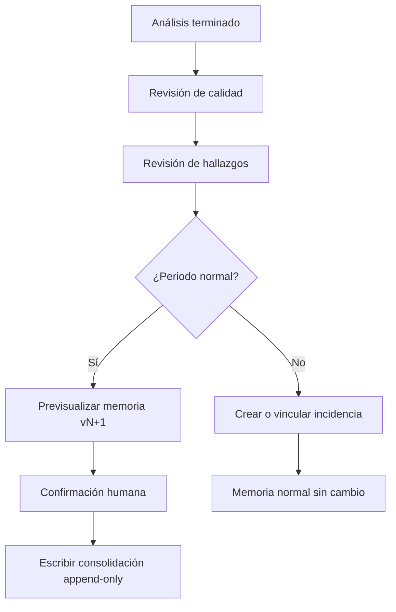

# Memoria longitudinal y consolidación

## 1. Objetivo

Conservar la evolución real del circuito con el mínimo volumen necesario para comparar periodos futuros. La memoria normal no es un archivo de todos los eventos: es una sucesión de estados validados, perfiles y divergencias relevantes.

## 2. Capas de información

| Capa | Contenido | Persistencia por defecto |
|---|---|---|
| Bruto activo | Archivos originales y filas | Solo durante la sesión/análisis; referencia por hash. Las lecturas normalizadas se retienen solo para las dos últimas exportaciones cargadas, R-DAT-023 |
| Trabajo | Eventos normalizados, índices y grafos temporales | Temporal, liberable por etapas |
| Resultado | Hallazgos, métricas, grafo del periodo | **Duradera como instantánea** por fichero desde 2026-09-26 (ADR-0015, R-DAT-023): un grafo con fecha de cientos de kilobytes, guardado solo, sin ser memoria consolidada |
| Memoria normal | Estado consolidado y deltas compactos | Duradera en `.agvproj` |
| Incidencias | Recorte mínimo, replay, informe y contramedidas | Duradera pero separada |

## 3. Qué se conserva al consolidar

- Identidad y periodo analizado.
- Hashes y metadatos de las fuentes, no necesariamente su contenido.
- Calidad y cobertura del periodo.
- Configuración, calendario, reglas y algoritmos aplicados.
- Grafo físico validado: nodos, transiciones, soporte y tiempos robustos.
- Perfiles esperados por contexto con tamaño de muestra y dispersión.
- Salud resumida por tag, tramo, AGV y cohorte.
- Divergencias individuales, grupales o colectivas relevantes.
- Cambios respecto a la versión anterior.
- Decisiones humanas: incluido, excluido, corregido, pendiente y justificación.
- Referencias a incidencias, sin incorporarlas al cálculo normal.

## 4. Qué no se conserva por defecto

- Todas las filas brutas.
- Copias duplicadas de datos comunes entre AGV.
- Estados de animación precalculados para cada instante.
- Tablas intermedias reconstruibles.
- Eventos normales repetitivos sin valor diferencial.
- Información de SOC/batería.

## 5. Compresión semántica

Para una transición estable se guarda una sola estructura:

```text
origen, destino, contextos, soporte,
AGV participantes, primera/última observación,
mediana, cuantiles/MAD, confianza y versión
```

Los AGV que coinciden con el consenso apuntan al estado común. Solo se guardan deltas por AGV cuando divergen: qué cambió, desde cuándo, cuánto soporte existe y cuándo volvió a coincidir. Esto evita almacenar el mismo grafo decenas de veces.

## 6. Flujo del botón «Consolidar periodo»


```mermaid
flowchart TD
  A[Análisis terminado] --> B[Revisión de calidad]
  B --> C[Revisión de hallazgos]
  C --> D{¿Periodo normal?}
  D -->|Sí| E[Previsualizar memoria vN+1]
  D -->|No| F[Crear o vincular incidencia]
  E --> G[Confirmación humana]
  G --> H[Escribir consolidación append-only]
  F --> I[Memoria normal sin cambio]
```

Antes de habilitar el botón deben cumplirse:

- circuito resuelto;
- fuentes aceptadas y hashes calculados;
- calidad suficiente o excepciones justificadas;
- periodo y calendario correctos;
- incidencias separadas o justificadas;
- lista de cambios visible;
- versión anterior disponible;
- posibilidad de cancelar antes de confirmar.

**Revisión de hallazgos (paso C), ya disponible en F3** (`UX_SPEC.md` §4.3, R-EVI-007). Cada
hallazgo queda pendiente, confirmado, descartado o pospuesto, con su nota. Decisión del propietario
(2026-09-23) para cuando exista el botón de consolidar: **solo bloquea lo que sigue pendiente**. Lo
pospuesto se puede consolidar con su motivo y vuelve a aparecer como pendiente en el análisis del
periodo siguiente. Desde 3.55.0 un hallazgo grave confirmado no bloquea: es una incidencia que se
excluye del esperado (R-INC-004, §8).

**Implementado el 2026-09-27** (`src/domain/memory.ts`, pestaña «Memoria», `UX_SPEC.md` §6). Los
pasos E, G y H del diagrama son `previewConsolidation` (no escribe nada), la confirmación humana en
la interfaz y `consolidate` en el Worker, que vuelve a calcular la previsualización desde el almacén
antes de escribir. Las precondiciones que hoy se comprueban con datos son: fichero de trabajo con
instantánea, hallazgos sin pendientes, ninguna versión vigente basada en el mismo fichero y ninguna
bifurcación sin resolver. Un hallazgo de rango 1 confirmado **no bloquea desde 3.55.0** (OQ-148, §8):
el periodo se consolida entero y lo que toca la incidencia queda fuera del esperado; el código
`periodo-de-incidencia` se conserva solo por compatibilidad con textos anteriores. Las demás de la lista
(calidad, calendario, incidencias separadas) quedan a la vista de la persona en el análisis, no las
decide la aplicación. La previsualización enseña las decisiones por estado, el delta frente a la
versión vigente y el tamaño estimado; cancelar antes de confirmar no deja rastro.

**El plano físico (2026-09-27, ADR-0016).** Desde una versión consolidada se crea, con una acción
humana, el plano del circuito: ubicaciones estables con su tag, que ya no cambian porque un tag
deje de leerse. Sus cambios —tag nuevo, sustitución, salida, revisión manual— son eventos
append-only que una persona confirma, y las estadísticas por ubicación y conexión se suman entre
periodos. Es la «versión de grafo» de §8 con su vigencia, su motivo y su evidencia.

## 7. Inmutabilidad y correcciones

Una consolidación nunca se edita. Si se descubre un error:

1. se registra una revocación que apunta a la versión afectada;
2. se crea una nueva consolidación corregida;
3. las comparaciones excluyen la versión revocada según reglas explícitas;
4. el historial y la razón permanecen visibles.

**Implementado**: revocar añade `{ at, reason }` a la versión; su hash no cambia, así que la cadena
de hashes sigue siendo comparable entre dispositivos. La versión vigente es la última no revocada,
`compareToMemory` y el delta de la siguiente consolidación la usan, y la lista de versiones enseña
las revocadas tachadas con su razón. La revocación es la única reescritura que admite el almacén.

**Revocar una versión intermedia no deshace lo que se construyó sobre ella.** Si v2 se revoca y ya
existe v3, el `expected` de v3 —calculado sobre el de v2— **sigue en vigor tal cual**: una versión no
se recalcula nunca (una consolidación nunca se edita) y la revocación no se propaga hacia delante.
Lo que cambia es la vigencia: si v3 es la última no revocada, v3 sigue siendo la vigente; si se
revoca la vigente, pasa a serlo la anterior no revocada. El comparador entre versiones lo deja a la
vista: `compareVersions` cuenta las revocadas del tramo en `between.revoked` y marca en
`adoptedAlongTheWay[].revoked` cada versión intermedia revocada cuyas adopciones forman parte del
camino. Corregir lo que v3 heredó de v2 es consolidar una v4 desde el fichero correcto, no reescribir.

## 8. Evolución del esperado

Un cambio observado no sustituye inmediatamente al esperado. Se clasifica como:

- evento puntual;
- incidencia;
- deriva pendiente;
- cambio colectivo sostenido;
- cambio confirmado de configuración/circuito.

Solo los últimos dos, tras revisión, pueden generar una nueva versión de grafo o perfil esperado. Las estadísticas antiguas conservan su vigencia.

**Implementado el 2026-09-27** (`src/domain/change-class.ts`, R-MEM-005, R-INC-004), con las
decisiones del propietario: sostenido son **tres ficheros seguidos** (OQ-146) y colectivo es **más
de la mitad de los AGV que pasan por el sitio** (OQ-147), los dos en configuración. Al previsualizar
vN+1, cada cambio frente al esperado vigente sale con su clase y su razón, agrupado; cada versión
guarda su **esperado** —lo observado salvo en lo no adoptado, donde conserva el valor anterior— y lo
observado frente a la memoria se compara con él. Lo que la instantánea no permite medir, se dice:

- Un vértice es colectivo si, en la sección entre anclas que lo contiene, lo muestran más de la
  mitad de los AGV que la recorren. Sin ese dato no se sabe, y no es colectivo.
- Un tramo no guarda tiempos por AGV: «la mayoría» se lee como que se movió la mediana de sus
  pasadas, que es lo que ya mide el criterio de horquilla (R-TIM-010).
- Moverse de sitio o cambiar de clase no tiene medida colectiva: solo pasa si una persona lo
  confirma con el plano.
- Secciones, sumas entre anclas, flota, línea, calles y hallazgos del esperado salen de lo observado.
- El esperado solo se guarda si difiere de lo observado, para no duplicar la versión.

**Incidencias (OQ-148).** Un hallazgo grave confirmado ya no bloquea: el periodo se consolida entero
y la incidencia queda en la versión, aparte del esperado, con lo que toca —los tags que nombra y
sus tramos—, que conserva el valor anterior o queda sin medida. Desde 3.57.0 (OQ-149) también los
hallazgos graves que ocurren en un instante, con su ventana: el primero de cola sin avanzar toca su
tag; la parada de la línea y el paso por la línea, el tag de entrada de la línea; el AGV que deja de
leer, la rotura de un AGV y la producción parada no tocan el grafo y quedan registrados con su AGV y
su ventana. La ventana es lo que permitirá recortar el periodo desde el archivo de originales. El plano físico se crea
desde el esperado de la versión, no desde lo observado.

**Ficheros seguidos a través de las consolidaciones (3.56.0).** La prueba de oro encontró que, si
se consolida cada periodo, un cambio permanente no llegaba nunca a tres ficheros: la historia de
cada consolidación empieza tras la versión vigente y solo tiene un fichero. Ahora, si la versión
vigente guardó un cambio sin adoptar y ese cambio sigue en todos los ficheros nuevos, su cuenta
continúa, y la razón lo dice («contando 2 de periodos ya consolidados»). Es la lectura literal de
«tres ficheros seguidos» (OQ-146), que no depende de cada cuánto se consolide; queda a la vista del
propietario. Con esa misma cadencia, un cambio de un solo periodo sale en su versión como «deriva
pendiente», porque en ese momento no se sabe aún si volverá; desde 3.57.0 (OQ-150), si en el último
fichero del periodo siguiente ya no está, la previsualización lo lista como evento puntual, «se vio
en vN y volvió», sin cambiar el esperado.

**Lo que no continúa la cuenta (3.62.0, OQ-158; propietario, 2026-09-27).** Solo se arrastra lo que
la versión vigente guardó como **deriva pendiente** sin adoptar. Lo que guardó como **incidencia** no
cuenta hacia sostenido: la medida de un tag o un tramo bajo un hallazgo grave confirmado no es prueba
de un cambio permanente. Si el cambio sigue en el periodo siguiente, su cuenta de ficheros seguidos
empieza con la historia nueva (un fichero, no tres), y sigue pendiente; tampoco sale como «se vio en
vN y volvió» si ya no está, porque nunca fue pendiente. Un evento puntual no guarda ficheros y no se
arrastra.

**Recorte de ventana (3.58.0).** Cierra OQ-148: al previsualizar, cada incidencia con ventana ofrece
«Recortar su ventana al consolidar», con principio y fin editables. La versión se construye desde
el fichero original archivado sin esas lecturas —las de un AGV, si la incidencia es suya; todas, si
no—, y el tiempo recortado queda sin cobertura. Sin original archivado no se puede recortar y se
dice. El reanálisis parte solo de ese fichero, así que las medidas que dependían de otra
exportación retenida en la ventana de trabajo pueden variar un poco respecto a la instantánea
guardada, aunque el recorte no quite nada.

**Todo hallazgo que cuenta al consolidar se puede revisar (3.57.0).** Cada sección enseña los
primeros de cada tipo y el resto en su tabla, pero la instantánea guarda todos: en el circuito de
auditoría quedaban hallazgos sin tarjeta —tags fuera de la lista, roturas— que habrían dejado la
consolidación pendiente para siempre. La bandeja los enseña ahora en «Más hallazgos del periodo».

**Comparador entre versiones (3.56.0).** `compareVersions` compara el esperado de dos versiones
cualesquiera del linaje activo —en cualquier orden—, dice cuántas versiones hay entre medias y
cuántas revocadas, y lista lo que adoptó cada una por el camino. La pestaña Memoria lo ofrece como
«Comparar versiones». La prueba de oro (`tests/unit/historia-oro.test.ts`) consolida seis periodos
con cambios plantados y comprueba que la comparación de la primera a la última da exactamente lo
adoptado.

## 9. Crecimiento y presupuesto

Objetivo candidato: en periodos normales, el incremento consolidado debe ocupar menos del 5 % del tamaño bruto equivalente, excluyendo evidencias de incidencias deliberadamente conservadas. Se medirá por:

- bytes de memoria por día consolidado;
- bytes por nodo/arista/contexto;
- bytes por divergencia e incidencia;
- tiempo de carga y migración;
- capacidad de compactar índices reconstruibles sin perder decisiones.

No se eliminará información confirmada solo para cumplir un porcentaje; primero se eliminan duplicaciones y derivados reconstruibles.

**Medido el 2026-09-26** con el circuito de auditoría (230.000 lecturas, 145 tags, 40 AGV): el
registro con todas las lecturas rondaba los 110 MB y pasó del límite de un valor de IndexedDB en
Chromium tras dos recargas (OQ-142); una instantánea del mismo fichero ocupa cientos de kilobytes.
El almacén queda acotado por las lecturas de una o dos exportaciones más una instantánea por
fichero (ADR-0015).

**Medido el 2026-09-27** (`tests/e2e/presupuesto-memoria.spec.ts`, TC-292): el mismo circuito
partido en cuatro periodos consecutivos de unas 12 horas, importados uno tras otro. Bytes por
periodo:

| Periodo | Lecturas | CSV | Lecturas guardadas | Lecturas con gzip | Instantánea | Versión | Versión con gzip | Versión / CSV | Versión con gzip / CSV |
|---|---:|---:|---:|---:|---:|---:|---:|---:|---:|
| 1 | 58.070 | 1.858.253 | 18.455.159 | 684.567 | 87.640 | 89.693 | 11.508 | 4,8 % | 0,62 % |
| 2 | 59.435 | 1.901.933 | 18.889.229 | 695.253 | 87.960 | 92.034 | 12.144 | 4,8 % | 0,64 % |
| 3 | 59.330 | 1.898.573 | 18.855.839 | 704.070 | 107.704 | 120.110 | 15.904 | 6,3 % | 0,84 % |
| 4 | 58.879 | 1.884.141 | 18.712.421 | 698.699 | 106.108 | 113.843 | 15.669 | 6,0 % | 0,83 % |

Lo que dicen las cifras:

- **Sin comprimir, la versión ronda el objetivo candidato y lo pasa en dos periodos.** Casi todo es la
  instantánea: los vértices (unos 47 KB para 145 tags) y las aristas, que crecen en los periodos 3 y
  4 porque entra el régimen de noche con su propia horquilla. Son datos, no duplicados. Además, el
  circuito de auditoría no es un periodo normal: lleva 54 clases de fallo plantadas, y las
  decisiones y el delta crecen con ellas.
- **La instantánea depende de cuántos tags tiene el circuito, no de cuántas lecturas**, así que con
  exportaciones más largas que 12 horas la proporción baja.
- **Comprimida, la versión ocupa menos del 1 % del CSV.** El JSON repite sus claves en cada vértice.
- **Conservar todas las lecturas comprimidas cuesta un 37 % del CSV**: unos 0,7 MB por cada 58.000
  lecturas. Es la idea del esbozo inicial de guardarlas para revisar el pasado.
- **Las lecturas retenidas ocupan diez veces el CSV** (unos 318 bytes por lectura normalizada): las
  dos exportaciones retenidas son unos 37 MB.

**Con el desglose por AGV (3.58.0)** cada instantánea del circuito de auditoría crece unos 82 KB sin
comprimir: la versión pasa del 4,9–6,4 % al 9,3–11,1 % del CSV, y comprimida del 0,63–0,85 % al
0,75–1,03 %. El objetivo aceptado es el 5 % sobre las versiones guardadas comprimidas, así que
sigue dentro con margen.

**Decidido el 2026-09-27 (OQ-145):** se acepta el objetivo del 5 % sobre el CSV, con las versiones
guardadas comprimidas; las lecturas retenidas también se guardan comprimidas, y cada fichero
original queda archivado comprimido con su huella —unos 300 KB por cada 1,9 MB de CSV en el
circuito de auditoría, un 16 %—. La pestaña Memoria dice lo que ocupa la memoria, lo guardado
comprimido y el archivo.

## 10. Bifurcación de linaje entre dispositivos

El intercambio entre dispositivos es manual (CON-002) y cada consolidación encadena el hash de la
anterior. Dos dispositivos que consolidan en paralelo a partir de la misma versión producen dos
linajes distintos e igualmente válidos. Esto no es un error a evitar: es una consecuencia del
diseño y hay que tratarla.

- Al abrir un `.agvproj`, la aplicación compara la cadena de hashes con la memoria local y
  clasifica la relación como `idéntica`, `local adelantada`, `entrante adelantada` o `bifurcada`.
- Una bifurcación **no se fusiona automáticamente**. Fusionar dos historiales append-only exigiría
  reinterpretar decisiones humanas, y eso está prohibido por R-MEM-002.
- Ante una bifurcación la aplicación muestra ambos linajes con su periodo, autor y decisiones, y
  ofrece tres salidas: conservar el local, adoptar el entrante conservando el local como histórico
  archivado, o volver al ancestro común y consolidar de nuevo el periodo en disputa.
- La elección queda registrada como un evento más del historial, con su justificación.
- Mientras una bifurcación esté sin resolver, la comparación histórica se marca como incompleta y
  la consolidación queda bloqueada.

**Implementado (2026-09-27)** con dos de las tres salidas: conservar el local (el entrante queda
archivado) o adoptar el entrante (el local queda archivado y el linaje adoptado sigue aquí). Volver
al ancestro común no tiene botón propio (propietario, 2026-09-27, OQ-144): se hace revocando en un
linaje y consolidando de nuevo. La clasificación (`classifyLineage`) va por la cadena de hashes ordenada por
versión: `identica` si coinciden, `local-adelantada` si la entrante es prefijo de la local,
`entrante-adelantada` si la local es prefijo de la entrante (entonces se adopta sin preguntar: es la
misma historia, más larga), `bifurcada` en el resto. El identificador de linaje lo genera el
dispositivo en su primera consolidación y se hereda al adoptar; lo que distingue dos ramas es el
hash, no ese identificador. Al abrir un `.agvproj`, en cualquier relación: las revocaciones que trae y aquí
no estaban se aplican, y el mensaje de apertura las dice una por una con su razón, porque cambian la
versión vigente; las elecciones de linaje del otro dispositivo se añaden al historial marcadas como
suyas («en otro dispositivo»), sin aplicarse. Las notas no hace falta copiarlas: forman parte del
hash, así que dos versiones iguales tienen la misma nota (OQ-144, cerrada el 2026-09-27). Un linaje entrante sin resolver no viaja en el `.agvproj` que se exporta desde aquí.

**Contra qué se clasifica (2026-09-27).** La sección `memoria` lleva las versiones del linaje activo
**y** de los archivados, mezcladas en `versiones`, y `linaje.activo` y `linaje.archivados` dicen cuál
es cuál. La relación se clasifica **solo contra la cadena de `linaje.activo`** (`planMemoryImport`):
las versiones de una rama archivada no son historia del activo, y contarlas hacía pasar por bifurcado
un destino idéntico al activo del origen, o hacía que un dispositivo vacío adoptara dos ramas como
una sola cadena con dos v2. Los archivados que trae el proyecto y aquí no estaban entran **como
archivados**, con sus versiones (`withArchivedLineages`): son historia de otro dispositivo, no una
decisión. No se repite uno que ya esté archivado (mismo identificador y misma cadena), ni se archiva
el que aquí es el activo o el que espera decisión. Un proyecto del esquema 3 sin `linaje.activo`
declarado se clasifica con todas sus versiones como un linaje, que es lo que era entonces.

**Con una bifurcación pendiente, nada se adopta ni se sustituye (2026-09-27).** Si aquí ya hay un
linaje entrante esperando decisión y se abre otro proyecto cuya relación no es `identica` ni
`sin-memoria`, el activo y el entrante se quedan como están: ni una `entrante-adelantada` se adopta
ni una `bifurcada` sustituye al entrante que espera (`pendingForkBlocks`). Se anota la relación, se
aplican las revocaciones y las elecciones ajenas, y la importación lo devuelve
(`pendingForkBlocked`) para que la interfaz diga que primero hay que resolver la que hay. Antes, el
segundo proyecto pisaba en silencio la decisión pendiente.

**Las revocaciones que llegan se aplican sin preguntar, en cualquier relación**, también en
`bifurcada` y `local-adelantada`: una revocación es un hecho del historial de la versión —lleva su
fecha y su razón— y no una decisión que este dispositivo deba reinterpretar. Se dice una por una al
abrir el proyecto. Si el propietario quisiera que la persona la aceptara antes de aplicarla, sería
una decisión nueva (R-MEM-001) a registrar en `OPEN_QUESTIONS.md`, no un cambio silencioso.

La forma de evitarla es organizativa, no técnica: consolidar siempre desde el mismo dispositivo, o
exportar e importar antes de consolidar. La aplicación lo recuerda, no lo impone.

## 11. Portabilidad

El `.agvproj` contiene manifiesto, versión, hashes e integridad. Al abrirlo:

- se valida antes de modificar el estado local: además del hash de cada sección, **la memoria que
  trae tiene que ser la que dice ser** (2026-09-27, `verifyProjectMemory`): cada versión vuelve a dar
  su `hash` al calcularlo (`versionHash`), y cada linaje —activo y archivados— encadena versiones
  presentes cuyo `previousHash` apunta a una anterior del mismo linaje (la vigente al consolidar, que
  no es siempre la inmediata si esta estaba revocada), y **no tiene dos versiones con el mismo
  número** (3.62.0, OQ-157; propietario, 2026-09-27): el número lo da siempre «uno más que el mayor
  guardado, revocadas incluidas», así que un linaje con dos versiones vN de distinto hash no lo
  escribió esta regla y se rechaza como cadena rota («el linaje «id» tiene dos versiones vN»), igual
  que uno que repite un hash. Una que falle rechaza la carga entera con `ProjectError`, sin tocar
  nada. Vale para cualquier versión desde la primera consolidación (F4): la
  regla del hash y `CANONICAL_VERSION` no han cambiado, y los campos añadidos después (`expected`,
  `changes`, `incidents`, `cuts`) son opcionales y no se escriben cuando faltan, así que una versión
  antigua vuelve a dar el hash con el que nació;
- se muestra qué evidencia bruta no está incluida;
- se realiza copia lógica antes de migrar;
- se prueba la ida y vuelta de la migración;
- no se mezclan circuitos automáticamente.
