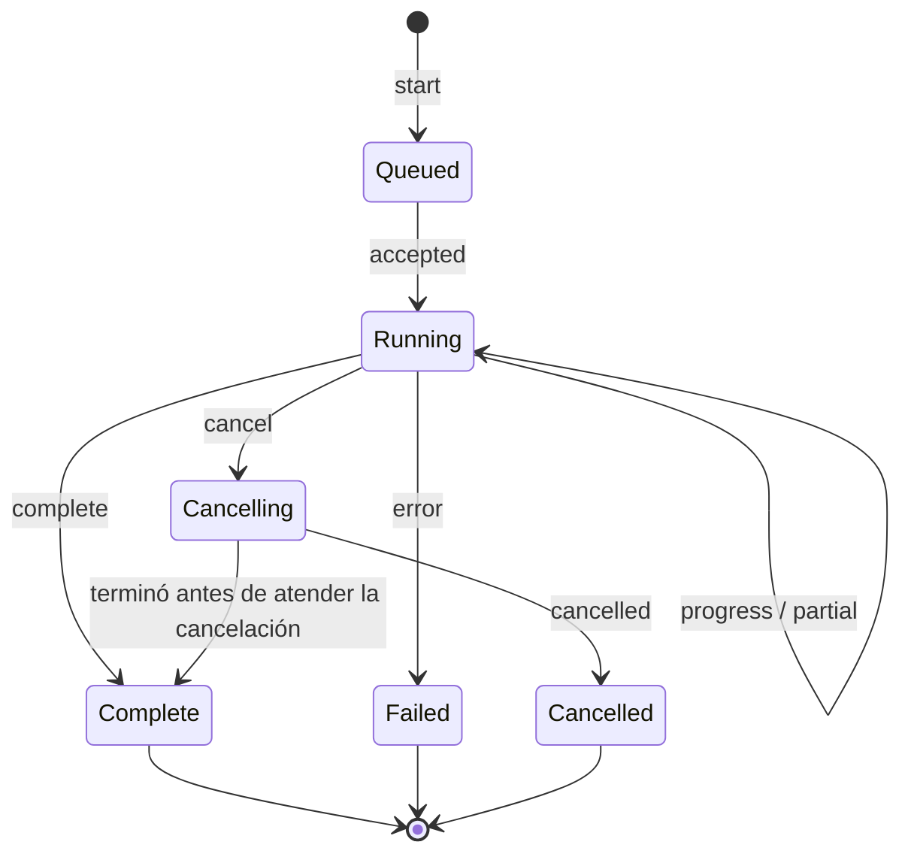

# Protocolo entre la interfaz y los Workers

## 1. Por qué existe este documento

ADR-0008 exige que todo cálculo pesado salga del hilo principal, RSK-007 identifica la carrera
Worker/UI como riesgo alto y TC-020 la convierte en caso de oro. Hasta ahora ningún documento
definía el contrato, y el prototipo demuestra qué ocurre sin él: la interfaz parseaba las fuentes
en el hilo principal «como comprobación previa», el Worker las volvía a parsear, y cuando el
resultado del Worker llegaba vacío la interfaz repetía el análisis completo en el hilo principal
para disimularlo. El síntoma visible fue un bloqueo en móvil y el mensaje `0 lecturas válidas`.

Este documento es normativo. Las expresiones **debe**, **no debe** y **solo** tienen su significado
habitual.

## 2. Reglas duras

| ID | Regla |
|---|---|
| WP-001 | Una fuente **debe** parsearse una sola vez por trabajo, y siempre dentro del Worker. La interfaz no parsea, ni siquiera para validar. |
| WP-002 | Ningún camino de recuperación **debe** ejecutar parseo o análisis en el hilo principal. Si el Worker falla, el resultado es un error explicado, nunca un cálculo de repuesto. |
| WP-003 | Todo mensaje **debe** llevar `job_id` y `protocol_version`. Un mensaje cuyo `job_id` no sea el trabajo vigente se descarta sin tocar el estado. |
| WP-004 | La cancelación **debe** ser cooperativa, mediante puntos de control deterministas. `terminate()` solo se admite como último recurso tras vencer el plazo de cortesía, y deja el estado en `cancelled`, nunca en `complete`. |
| WP-005 | Un resultado vacío **debe** ser un resultado legítimo y explicado, no un síntoma que la interfaz corrija. Si el Worker devuelve cero lecturas, esa es la respuesta y debe venir con causa y ejemplos. |
| WP-006 | Los bloques grandes **deben** viajar como `Transferable`. Está prohibido clonar el contenido íntegro de una fuente en cada mensaje. |
| WP-007 | Un resultado parcial **debe** marcarse `partial: true` y **no** puede consolidarse ni persistirse como memoria normal. |
| WP-008 | El progreso **debe** publicarse por etapa con unidad conocida, para que la interfaz no invente porcentajes. |

## 3. Ciclo de vida de un trabajo



Solo `Complete`, `Failed` y `Cancelled` son estados finales. La interfaz mantiene como mucho un
trabajo vigente por circuito; iniciar otro cancela el anterior antes de encolar el nuevo.

## 4. Mensajes

Sobre común de todo mensaje:

```text
protocol_version : entero, incompatible al cambiar
job_id           : identificador único del trabajo
seq              : número de secuencia creciente dentro del trabajo
type             : start | accepted | progress | partial | complete | error | cancel | cancelled
```

### De la interfaz al Worker

| `type` | Carga | Nota |
|---|---|---|
| `start` | referencias a fuentes, configuración vigente, versiones de reglas/algoritmos, semilla | Las fuentes viajan como `File`/`ArrayBuffer` transferido, no como texto ya leído. |
| `cancel` | motivo | El Worker debe atenderla en el siguiente punto de control. |

### Del Worker a la interfaz

| `type` | Carga | Nota |
|---|---|---|
| `accepted` | etapas previstas | Confirma que el trabajo empezó; sirve para detectar Workers que no arrancan. |
| `progress` | etapa, unidades hechas, unidades previstas, mensaje | Sin porcentajes inventados. |
| `partial` | resultado incompleto | Siempre `partial: true`. |
| `complete` | resultado, métricas, hash semántico, advertencias | Único mensaje que autoriza a persistir. |
| `error` | código, causa, esquema detectado, filas de ejemplo, acción sugerida | Ver §6. |
| `cancelled` | etapa alcanzada, recursos liberados | El estado anterior permanece intacto. |

## 5. Cancelación

1. La interfaz envía `cancel` y pasa a `Cancelling`.
2. El Worker atiende la petición en el siguiente punto de control y responde `cancelled`.
3. Si no responde dentro del plazo de cortesía configurado, la interfaz llama a `terminate()`,
   registra el incidente y deja el estado en `cancelled`.
4. Cancelar **no debe** dejar proyecto parcial, consolidación a medias ni memoria escrita (INV-006).
5. Las fuentes originales permanecen intactas.

## 6. Errores

Un error se identifica por código estable y **debe** llevar causa legible, esquema detectado, filas
de ejemplo saneadas y acción de recuperación. `UX_SPEC.md` §8 lo exige y el prototipo lo incumplía.

| Código | Significado |
|---|---|
| `SOURCE_UNREADABLE` | El fichero no se pudo leer o decodificar. |
| `SCHEMA_UNRECOGNISED` | No se identificaron las columnas mínimas Fecha–AGV–Tag. |
| `DELIMITER_AMBIGUOUS` | La puntuación de confianza del delimitador no alcanza el mínimo. |
| `DATE_AMBIGUOUS` | Formato día/mes indistinguible; prohibido resolver por suposición. |
| `NO_ACCEPTED_ROWS` | Se leyeron filas pero ninguna superó la validación. Debe detallar por qué. |
| `LIMIT_EXCEEDED` | Se superó un límite de tamaño, celdas o memoria declarado. |
| `CIRCUIT_FOREIGN` | La huella de afinidad sitúa la fuente en otro circuito. |
| `INTERNAL` | Defecto del propio motor; nunca debe usarse para tapar los anteriores. |

Ningún mensaje de error **debe** incluir contenido bruto sin sanear (TH-003).

## 7. Criterios de aceptación

Estos criterios se verifican en F1a y son la traducción ejecutable de TC-020 y RSK-007.

- [ ] Un perfil de rendimiento durante la importación no muestra parseo en el hilo principal.
- [ ] El hilo principal cumple el presupuesto de tarea larga de `PERFORMANCE_BUDGET.md` §3.
- [ ] Un mensaje con `job_id` caducado no altera la vista ni la persistencia.
- [ ] Cancelar a mitad deja el proyecto en el estado anterior, comprobado por hash.
- [ ] Un fichero sin filas válidas produce `NO_ACCEPTED_ROWS` con esquema, causa y ejemplos.
- [ ] Sustituir el Worker por uno que responde vacío **no** dispara ningún cálculo alternativo.
- [ ] Reordenar artificialmente la llegada de `progress`, `complete` y `cancelled` no produce un
      estado incoherente.
